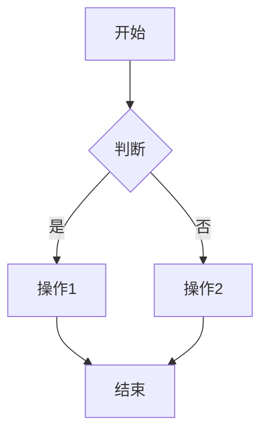
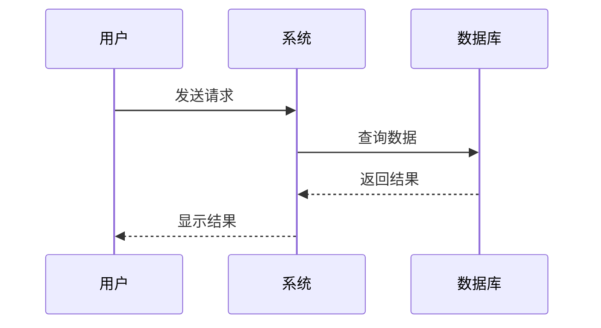
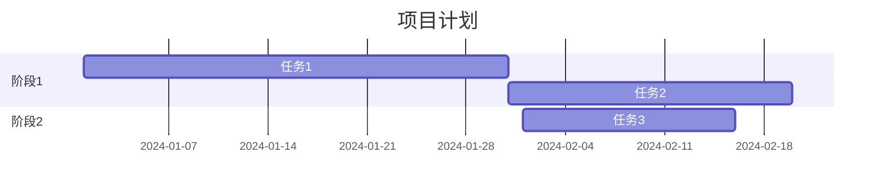

## 🤖 Assistant

# 📝 Markdown 常用语法指南

---

## **一、标题（Headings）**

### **语法**

```markdown
# 一级标题
## 二级标题
### 三级标题
#### 四级标题
##### 五级标题
###### 六级标题
```


### **效果**

# 一级标题
## 二级标题
### 三级标题
#### 四级标题
##### 五级标题
###### 六级标题

### **注意事项**

```markdown
✅ 正确：# 标题         (# 后面有空格)
❌ 错误：#标题          (# 后面没有空格)

✅ 正确：一行一个标题
❌ 错误：一行多个标题
```

---

## **二、文本格式**

### **1. 粗体（Bold）**

```markdown
**粗体文本**
__粗体文本__
```

**效果：** **这是粗体**


---

### **2. 斜体（Italic）**

```markdown
*斜体文本*
_斜体文本_
```

**效果：** *这是斜体*

---

### **3. 粗斜体**

```markdown
***粗斜体***
___粗斜体___
**_粗斜体_**
```

**效果：** ***这是粗斜体***

---

### **4. 删除线**

```markdown
~~删除的文本~~
```

**效果：** ~~这是删除线~~

---

### **5. 下划线**

```markdown
<u>下划线文本</u>
```

**效果：** <u>下划线文本</u>

---

### **6. 高亮（部分编辑器支持）**

```markdown
==高亮文本==
```

---

## **三、列表（Lists）**

### **1. 无序列表**

```markdown
- 项目1
- 项目2
- 项目3

或者

* 项目1
* 项目2
* 项目3

或者

+ 项目1
+ 项目2
+ 项目3
```

**效果：**

- 项目1
- 项目2
- 项目3

---

### **2. 有序列表**

```markdown
1. 第一项
2. 第二项
3. 第三项
```

**效果：**

1. 第一项
2. 第二项
3. 第三项

---

### **3. 嵌套列表**

```markdown
- 一级项目
  - 二级项目
    - 三级项目
  - 二级项目2
- 一级项目2
```

**效果：**

- 一级项目
  - 二级项目
    - 三级项目
  - 二级项目2
- 一级项目2

---

### **4. 混合列表**

```markdown
1. 有序列表
   - 无序子项
   - 无序子项
2. 有序列表
   1. 有序子项
   2. 有序子项
```

**效果：**

1. 有序列表
   - 无序子项
   - 无序子项
2. 有序列表
   1. 有序子项
   2. 有序子项

---

### **5. 任务列表（Todo List）**

```markdown
- [x] 已完成任务
- [ ] 未完成任务
- [ ] 待办事项
```

**效果：**

- [x] 已完成任务
- [ ] 未完成任务
- [ ] 待办事项


---

## **四、链接（Links）**

### **1. 行内链接**

```markdown
[链接文字](https://www.example.com)
[链接文字](https://www.example.com "鼠标悬停提示")
```

**效果：** [百度](https://www.baidu.com)


---

### **2. 参考式链接**

```markdown
这是一个[参考链接][1]

[1]: https://www.example.com
```

---
### **3. 自动链接**

```markdown
<https://www.example.com>
<email@example.com>
```

**效果：** <https://www.baidu.com>

---

### **4. 锚点链接（页内跳转）**

```markdown
[跳转到标题](#标题名称)

## 标题名称
```

---

## **五、图片（Images）**

### **1. 基本语法**

```markdown


```

---

### **2. 本地图片**

```markdown

```

---

### **3. 图片带链接**

```markdown
[](链接URL)
```

---

### **4. 调整图片大小（HTML）**

```markdown

```

---

## **六、代码（Code）**

### **1. 行内代码**

```markdown
这是 `行内代码` 示例
```

**效果：** 这是 `行内代码` 示例

---

### **2. 代码块**

#### **方法一：缩进**

```markdown
    def hello():
        print("Hello World")
```

#### **方法二：围栏代码块（推荐）**

````markdown
```python
def hello():
    print("Hello World")
```
````

**效果：**


```python
def hello():
    print("Hello World")
```

---

### **3. 常用语言标识**

```markdown
```python      # Python
```java        # Java
```javascript  # JavaScript
```c           # C
```cpp         # C++
```bash        # Bash/Shell
```sql         # SQL
```html        # HTML
```css         # CSS
```json        # JSON
```yaml        # YAML
```markdown    # Markdown
```
````

---

### **4. 高亮特定行（部分编辑器支持）**

````markdown
```python {1,3-5}
def hello():
    name = "World"
    message = f"Hello {name}"
    print(message)
    return message
```
````

---

## **七、引用（Blockquotes）**

### **1. 基本引用**

```markdown
> 这是一段引用文字
```

**效果：**

> 这是一段引用文字

---

### **2. 多行引用**

```markdown
> 第一行引用
> 第二行引用
> 第三行引用
```

**效果：**

> 第一行引用
> 第二行引用
> 第三行引用

---

### **3. 嵌套引用**

```markdown
> 一级引用
>> 二级引用
>>> 三级引用
```

**效果：**

> 一级引用
>> 二级引用
>>> 三级引用

---

### **4. 引用中使用其他元素**

```markdown
> ## 引用中的标题
> 
> - 列表项1
> - 列表项2
>
> **粗体文字** 和 *斜体文字*
```

**效果：**

> ## 引用中的标题
> 
> - 列表项1
> - 列表项2
>
> **粗体文字** 和 *斜体文字*

---

## **八、分割线（Horizontal Rules）**

### **语法**

```markdown
---

***

___

- - -
```

**效果：**

---

---

## **九、表格（Tables）**

### **1. 基本表格**

```markdown
| 表头1 | 表头2 | 表头3 |
|-------|-------|-------|
| 内容1 | 内容2 | 内容3 |
| 内容4 | 内容5 | 内容6 |
```

**效果：**

| 表头1 | 表头2 | 表头3 |
|-------|-------|-------|
| 内容1 | 内容2 | 内容3 |
| 内容4 | 内容5 | 内容6 |

---

### **2. 对齐方式**

```markdown
| 左对齐 | 居中对齐 | 右对齐 |
|:-------|:--------:|-------:|
| 内容1  | 内容2    | 内容3  |
| 内容4  | 内容5    | 内容6  |
```

**效果：**

| 左对齐 | 居中对齐 | 右对齐 |
|:-------|:--------:|-------:|
| 内容1  | 内容2    | 内容3  |
| 内容4  | 内容5    | 内容6  |

**对齐说明：**

```markdown
|:---    左对齐（默认）
|:---:   居中对齐
|---:    右对齐
```

---

### **3. 表格中使用格式**

```markdown
| 姓名 | 技能 | 备注 |
|------|------|------|
| 张三 | **Python** | `优秀` |
| 李四 | *Java* | ~~一般~~ |
```

**效果：**

| 姓名 | 技能 | 备注 |
|------|------|------|
| 张三 | **Python** | `优秀` |
| 李四 | *Java* | ~~一般~~ |

---

## **十、特殊符号**

### **1. 转义字符**

```markdown
\*   星号
\_   下划线
\#   井号
\+   加号
\-   减号
\.   英文句点
\!   感叹号
\`   反引号
\[   左方括号
\]   右方括号
\(   左括号
\)   右括号
```

**示例：**

```markdown
\*这不是斜体\*
```

**效果：** \*这不是斜体\*

---

### **2. HTML 实体**

```markdown
&copy;   ©
&reg;    ®
&trade;  ™
&nbsp;   空格
&lt;     <
&gt;     >
&amp;    &
```

---

## **十一、数学公式（LaTeX）**

### **1. 行内公式**

```markdown
这是行内公式 $E=mc^2$
```

**效果：** 这是行内公式 $E=mc^2$

---

### **2. 独立公式块**

```markdown
$$
\sum_{i=1}^{n} i = \frac{n(n+1)}{2}
$$
```

**效果：**

$$
\sum_{i=1}^{n} i = \frac{n(n+1)}{2}
$$

---

### **3. 常用数学符号**

```markdown
$\alpha$  α
$\beta$   β
$\gamma$  γ
$\sum$    求和
$\prod$   求积
$\int$    积分
$\frac{a}{b}$  分数
$\sqrt{x}$     平方根
$x^2$          上标
$x_1$          下标
```

---

## **十二、脚注（Footnotes）**

### **语法**

```markdown
这是一个脚注[^1]

[^1]: 这是脚注的内容
```

**效果：**

这是一个脚注[^1]

[^1]: 这是脚注的内容

---

## **十三、缩写/定义列表**

```markdown
*[HTML]: Hyper Text Markup Language
*[CSS]: Cascading Style Sheets

HTML 和 CSS 是网页开发的基础
```

---

## **十四、折叠内容（部分编辑器支持）**

```markdown
<details>
<summary>点击展开</summary>

这是折叠的内容
可以是任何 Markdown 格式

- 列表项
- 代码块
- 等等

</details>
```

**效果：**

<details>
<summary>点击展开</summary>

这是折叠的内容

- 列表项
- 代码块

</details>

---

## **十五、emoji 表情**

### **语法**

```markdown
:smile:
:heart:
:thumbsup:
:fire:
:rocket:
```

**效果：**

😄 ❤️ 👍 🔥 🚀

---

### **常用 emoji**

```markdown
:smile:        😄
:laughing:     😆
:blush:        😊
:heart:        ❤️
:broken_heart: 💔
:thumbsup:     👍
:thumbsdown:   👎
:ok_hand:      👌
:clap:         👏
:fire:         🔥
:rocket:       🚀
:star:         ⭐
:warning:      ⚠️
:check:        ✅
:x:            ❌
:bulb:         💡
:books:        📚
:pencil:       ✏️
:computer:     💻
:email:        📧
```

---

## **十六、HTML 标签**

Markdown 支持内嵌 HTML：

### **1. 颜色文字**

```markdown
<span style="color:red">红色文字</span>
<span style="color:blue">蓝色文字</span>
```

---

### **2. 文字大小**

```markdown
<font size="5">大号文字</font>
<font size="3">正常文字</font>
<font size="1">小号文字</font>
```

---

### **3. 居中**

```markdown
<center>居中文字</center>
```

---

### **4. 键盘按键**

```markdown
<kbd>Ctrl</kbd> + <kbd>C</kbd>
```

**效果：** <kbd>Ctrl</kbd> + <kbd>C</kbd>

---

## **十七、流程图（Mermaid）**

### **1. 流程图**

````markdown

````

---

### **2. 时序图**

````markdown

````

---

### **3. 甘特图**

````markdown

````

---

## **十八、实用技巧**

### **1. 换行**

```markdown
方法一：行末加两个空格  
然后换行

方法二：使用 <br> 标签
第一行<br>第二行

方法三：空一行（段落）

第一段

第二段
```

---

### **2. 注释**

```markdown
<!-- 这是注释，不会显示 -->

[//]: # (这也是注释)

[comment]: <> (这还是注释)
```

---

### **3. 目录生成**

```markdown
[TOC]

或

[[_TOC_]]
```

（部分编辑器自动生成目录）

---

### **4. 文本框/高亮块**

```markdown
> [!NOTE]
> 这是提示信息

> [!WARNING]
> 这是警告信息

> [!IMPORTANT]
> 这是重要信息
```

---

## **十九、不同平台特性**

### **GitHub Markdown**

```markdown
- [x] 支持任务列表
- [ ] 支持 @用户名 提及
- [ ] 支持 #issue编号 引用
- [ ] 支持表情符号 :emoji:
```

---

### **Typora**

```markdown
- 支持实时预览
- 支持图片拖拽
- 支持 LaTeX 公式
- 支持 Mermaid 图表
- 支持自定义主题
```

---

### **VS Code**

```markdown
- 支持插件扩展
- 支持代码片段
- 支持实时预览
- 支持 Git 集成
```

---

## **二十、完整示例**

```markdown
# 项目文档

## 简介

这是一个**示例项目**，用于演示 *Markdown* 的各种语法。

## 功能特性

- [x] 功能1：已完成
- [ ] 功能2：开发中
- [ ] 功能3：计划中

## 安装步骤

1. 克隆仓库
   ```bash
   git clone https://github.com/user/repo.git
   ```

2. 安装依赖
   ```bash
   npm install
   ```

3. 运行项目
   ```bash
   npm start
   ```

## 配置说明

| 参数 | 类型 | 说明 | 默认值 |
|:-----|:----:|:-----|-------:|
| port | Number | 端口号 | 3000 |
| host | String | 主机地址 | localhost |

## API 文档

### 获取用户信息

**请求：**

```http
GET /api/user/:id
```

**响应：**

```json
{
  "id": 1,
  "name": "张三",
  "email": "zhangsan@example.com"
}
```

## 注意事项

> ⚠️ **警告**
> 
> 请勿在生产环境使用默认配置！

## 参考链接

- [官方文档](https://example.com)
- [GitHub 仓库](https://github.com/user/repo)

## 许可证

MIT License © 2024

---

**最后更新：** 2024-01-01
```

---

## **总结：最常用的语法**

```markdown
✅ 必须掌握
├─ # 标题
├─ **粗体** *斜体*
├─ - 列表
├─ [链接](url)
├─ 
├─ `代码`
├─ ```代码块```
├─ > 引用
└─ | 表格 |

⭐ 常用扩展
├─ - [x] 任务列表
├─ :emoji: 表情
├─ <!-- 注释 -->
├─ ~~删除线~~
└─ <kbd>按键</kbd>

💡 高级技巧
├─ Mermaid 流程图
├─ LaTeX 数学公式
├─ HTML 标签
└─ 折叠内容
```

---

**实践建议：**

1. **边写边预览** - 使用支持实时预览的编辑器（Typora、VS Code）
2. **多练习** - 写博客、笔记、文档时多用 Markdown
3. **查手册** - 遇到不会的语法及时查询
4. **看源码** - 看别人写的 Markdown 文件学习

---

**推荐工具：**

- **在线编辑器：** [StackEdit](https://stackedit.io)、[Dillinger](https://dillinger.io)
- **桌面编辑器：** Typora、Mark Text、VS Code
- **笔记软件：** Obsidian、Notion、语雀

---

需要我详细讲解某个特定语法吗？或者帮你实现某个排版效果？😊
