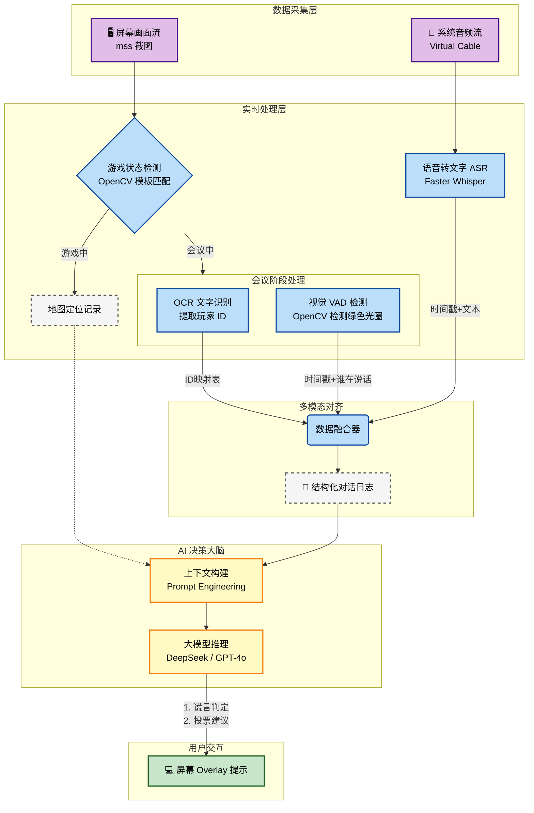
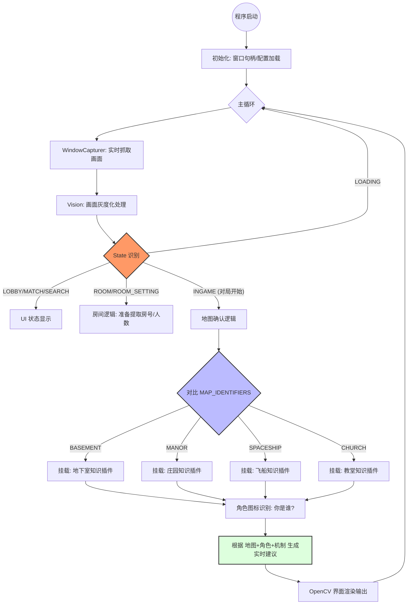

---

excalidraw-plugin: parsed
tags: [excalidraw]

---
==⚠  Switch to EXCALIDRAW VIEW in the MORE OPTIONS menu of this document. ⚠== You can decompress Drawing data with the command palette: 'Decompress current Excalidraw file'. For more info check in plugin settings under 'Saving'


# Goose Goose Duck




# GooseMind

理顺了！为了让你更直观地看到这个“鹅鸭杀辅助”的指挥体系，我为你生成了一份 **Mermaid** 格式的流程图。

这份图表涵盖了从**窗口采集**到**场景分发**，再到你刚才要求的**地图确认**以及后续**角色/任务插件**的完整逻辑架构。



### 1. 流程图逻辑说明（理顺关键点）

* **双层过滤系统**：
* **第一层**：先认场景（LOBBY, ROOM, INGAME）。这样可以避免在房间里乱跑地图识别逻辑，节省 CPU。
* **第二层**：进入 `INGAME` 后，触发 `MAP_IDENTIFIERS` 的指纹比对，精准锁定四个地图之一。


* **优先级阻断**：
* 你在图中可以看到，`ROOM_SETTING` 会在 `ROOM` 之前被判定（虽然图中简化了分支），确保弹出框不会被漏掉。


* **模块化扩展**：
* 最后的“Advice（实时建议）”是一个开放接口。等我们把地图和角色都认准了，这里就可以接入你说的“20多种角色机制”和“地图特殊任务”手册。


---

### 2. 逻辑进度确认

目前我们已经完成了图中**上半部分**的所有场景识别（6个 Key 完美对齐），现在正停在**“地图确认逻辑”**的门口。

**这份流程图符合你脑海中的构思吗？如果你觉得逻辑顺了，我们下一步就按照 `MAP_IDENTIFIERS` 的清单，把那四个地图的“指纹识别”代码实装到 `vision.py` 中，如何？**


# 11

这是根据我们刚才沟通的逻辑，为你**修正并重构**后的 Mermaid 流程图代码。

这个版本修复了你之前提到的逻辑漏洞，加入了**“角色锁定机制”**、**“会议强制中断”**以及**“幽灵形态（死后）任务逻辑”**。

你可以直接复制到 Obsidian 或 Excalidraw 中使用。

```mermaid
graph TD
    %% 定义样式
    classDef init fill:#e1f5fe,stroke:#01579b,stroke-width:2px;
    classDef logic fill:#fff9c4,stroke:#fbc02d,stroke-width:2px;
    classDef action fill:#c8e6c9,stroke:#2e7d32,stroke-width:2px;
    classDef interrupt fill:#ffccbc,stroke:#bf360c,stroke-width:2px;
    classDef dead fill:#e0e0e0,stroke:#616161,stroke-width:2px,stroke-dasharray: 5 5;

    Start((程序启动)) --> Init[初始化配置 & 窗口句柄]:::init
    Init --> Lobby[大厅等待 / 房间识别]:::init

    %% 阶段一：身份确立（独立于游戏主循环）
    subgraph Phase_Identity [第一阶段：身份锁定]
        direction TB
        ModeCheck{检测模式}:::logic
        Lobby --> ModeCheck
        
        ModeCheck -- 轮抽/选角模式 --> Draft[AI建议:根据板子推荐选角]:::action
        Draft --> Pick[玩家选择角色]:::action
        Pick --> RoleReveal
        
        ModeCheck -- 经典模式 --> RoleReveal[视觉识别: 身份揭示页]:::action
        
        RoleReveal --> LockRole[🔒 锁定变量: Current_Role<br/>(整局不再变)]:::logic
    end

    LockRole --> MainLoop{游戏主循环}:::logic

    %% 阶段二：动态循环（核心逻辑）
    subgraph Phase_Loop [第二阶段：实时博弈]
        direction TB
        
        %% 核心判断：会议优先级最高
        MainLoop -- 循环检测 --> IsMeeting{检测是否开会?<br/>(报警/尸体/摇铃)}:::interrupt
        
        %% 分支A：会议模式
        IsMeeting -- YES: 🚨进入会议 --> MeetingMode[会议辅助模式]:::interrupt
        MeetingMode --> Audio[ASR 语音转文字]:::action
        MeetingMode --> VAD[视觉检测: 谁在说话]:::action
        MeetingMode --> Logic[AI大脑: 谎言分析 & 投票建议]:::logic
        Logic --> VoteResult{会议结束}:::logic
        VoteResult --> MainLoop

        %% 分支B：漫游模式
        IsMeeting -- NO: 游戏中 --> IsAlive{检测存活状态<br/>(是否变鬼?)}:::logic
        
        %% 子分支：活人逻辑
        IsAlive -- ❤️ 存活 --> LiveAction[活人策略]:::action
        LiveAction -- 好人(鹅) --> Task[导航: 做任务/防杀]:::action
        LiveAction -- 坏人(鸭/中立) --> Kill[导航: 找落单/卡CD/搞破坏]:::action
        
        %% 子分支：死人逻辑
        IsAlive -- 👻 死亡 (幽灵) --> GhostAction[幽灵策略]:::dead
        GhostAction -- 好人(鹅) --> GhostTask[提示: 穿墙去做任务!<br/>(任务获胜)]:::dead
        GhostAction -- 坏人(鸭) --> GhostSabotage[提示: 关门/关灯/开上帝视野报点]:::dead
        
        Task --> UpdateLoc[更新坐标 & 轨迹记忆]
        Kill --> UpdateLoc
        GhostTask --> UpdateLoc
        GhostSabotage --> UpdateLoc
        
        UpdateLoc --> CheckEnd{游戏结束?}:::logic
    end

    CheckEnd -- NO --> MainLoop
    CheckEnd -- YES --> Result[结算页面: 记录胜负]:::init
    Result --> Lobby

```

### 这个流程图修复了哪三个关键点？

1. **身份逻辑剥离（Phase_Identity）**：
* 我把“角色识别”从主循环里拿出来了。现在它只在开局时运行一次，然后**锁定变量**。
* 解决了“每一帧都在问自己我是谁”的资源浪费和逻辑错误。


2. **会议打断机制（IsMeeting 判定）**：
* 在进入跑图逻辑前，**先判断**是否在开会。
* 只要检测到报警画面，立刻切断所有地图导航逻辑，转入听觉分析模块。


3. **幽灵打工逻辑（GhostAction）**：
* 增加了 `IsAlive` 判断。
* 如果你是好人且死了，AI 会催你去完成任务（`GhostTask`），这符合游戏赢法。
* 如果你是坏人且死了，AI 会教你如何用鬼魂技能搞破坏（`GhostSabotage`）。


你可以现在把它导入 Excalidraw 看看效果，这应该比之前的版本更符合实际开发逻辑。

# Excalidraw Data

## Text Elements
## Element Links
JOlDbZBq: [[Tools/鹅鸭杀神算子/Drawing 2026-01-27 00.33.35.excalidraw.md#Goose Goose Duck]]

u4Pd8KMz: [[Tools/鹅鸭杀神算子/Drawing 2026-01-27 00.33.35.excalidraw.md#GooseMind]]

%%
## Drawing
```compressed-json
N4KAkARALgngDgUwgLgAQQQDwMYEMA2AlgCYBOuA7hADTgQBuCpAzoQPYB2KqATLZMzYBXUtiRoIACyhQ4zZAHoFAc0JRJQgEYA6bGwC2CgF7N6hbEcK4OCtptbErHALRY8RMpWdx8Q1TdIEfARcZgRmBShcZQUebQBGAHZtHho6IIR9BA4oZm4AbXAwUDBSiBJuCAApAHl8ABFNAC0AIQBHNNLIWERKzM0EYmJcTWDOssxuZwBWAA446f4ymCnE

te0AFgBmRMWiyAoSdW54nl2lyEkEQmVpE4A2HgBOC4hrZTG0e5TZgAYNp5nJ6zWZrLbxeKvZhQUhsADWCAAwmx8GxSJUAMS/bE48aQTS4bBw5SwoQcYjI1HoiQw6zMOC4QI5PEQABmhHw+AAyrBPuhJISNIEWdDYQiAOpHSQnKEw+EIHkwPkQQQeFmk24ccJ5NCQ/YQNgM7BqFa67GvUnkrXMHWoDhCTlQhCDE5zaYvfWMFjsLhoLZbX6vL2sTgA

OU4YldEN+8Xu92m91eQjgwygLt1iXuTw2G2mG3iszzeq65WY9QyaeI3FZBDCrxJwjgAEliLb8gBdV6aYTkgCiwSyOTbnf1RA4cMq+XyABU2CiIoBRPMAtHmAAXNAHqegHTvQAK2gp6uRDhxlLxfjx7s4Y84zqhsdp/bfpto3AQSPvtPpiBiAOJzsKob9sX96iEIl23bFlUSJdNUBrfA631VlyCyFtuHtR19WYdxxFQQoujAYsunifYRxLbAhGhAx

6lwKJuBKEt3wABVhOQaP2MoyIQGp7BIJxyxrB1cmrWsEAuMoCSJBsyWIABZKjsEkRFrHoUJBNg4TWPxQliUtaTZMkftMmyKBuBhIQ1NwjTxO0yk0UxVk7LxUTNIk8kaiNE1uHuQN1IgbtSGIJgZKgOT9MHIy0BMszcJ8tF/NIazqXQDE7NZBz8RiphXMJdy0C88y2Q5bJcCyAA1QhWFGLCYLCViAF99hq15CHJLBKlwX4ICKBqiloyAKgkIQNno4

hZgAaSkowWR6LCMH0AYhhGMZXkmNBnESeItk2GMEyeeINkSDY40TfVTVQU45m0Hbph4U84yeYFY1eQ5iGOXUtlmb4eA2Hh/TegN3XmV4rhuO5dSeLYH1jHhYy2eM82mX5Eled4+VyspRXleLMRxXEuycqyURsmlyA4elGUMll2U5RVlQFOSRCQWUxQQSVnulXVGflanptVCoLWETVtRlfVDSy2ATnNfVtOtW1UPwJ0oJBIsgyYENfVQcEPRLYMfX

DDhIzQHg/lmJ4E1+WYkxTKioKSLMc2mTMvp4PYSzK8tgkrFS4JLCTm1bApiNEntiBCwzh1eMcJwkKdZ3nBRl3Xbdd33Jqjx4E8zwvK8bzvcHHxwZ9PAoN8P3/MIpKa4hQPAthIKrNAqsiyAEKKhBkLQWWoUwgpWPw0pCK6APIFI8j9Eo6i0B6yAGKY21J8gdjOIcHiED4/ABProSRIsrSg8CuSFI4JTbQbrefLx3fdJD5lwtIUzT7EnfJMxiQkvs

+/z8kzLjTFr5UZLXzYp7z0gOcmN877eQAUwZ+iVkqpWin5DKbkf7XlPpTQqJUyqEAqp7BAtV6qNWastdAuB4gdVKF1UoPVyh13QIkGAmh6gADF6KJBaJNeA01+iDGGNgpaUx7i5m0PcWYWwnj7VzODWY8RnbLG4FsXMTxtCJBEYWWY2xPJ3XNvqJ6L1UAbAliWIGtwwqoHhn/N4h4UYcwRNAiAWJsbtVxpZIOtjaQkwZEyIyrxKbcl5NNWmQoGbo

TlBKKUQsSzowRFzSoPMqx8z8JIaW4Sygi2/ideIBiyhS0Fu3B0ct0LOhoaCI6WsVY+m4O6ZW3owwRiwhksRacEYJgtqma2mZsx7V+NmX4jxGplgrFBCK9ZSS+zDvqbskkr7r2woPCAEdJwzjnLBOOq5Nw7j3JQFOx5TznniJeRI15fi3g2rnJ8HhXzvgxBCKu4ca4IhoSfeCiFW40I7uhLuaAcIEREv3Uoszh5QAolRXALEorT0NLPbyC8uKOGsL

xXA/Fj6bwgR/ckQCD5Hxwe/ZxkkgFTOMrfRujkcXklsa/FK2LH4uSQSdTy990qkDxSA6+qAhkQIZWS2B9KEGkC/tlFB3k0EcBbqVcqfIG54K6BQsoFcWoSFwKkTq4BiJvDgHAHkVtQXdCuFkSoRBjHjAYIQBAFAWioopATBKdjkpcqKBAUipBPFNjTPoHkTMyXxAQJ6z1hqHVOpdWaklFqqSVDcaTTxvqRD+syIwjkvilTcxRLzO1frDLOsyG6+U

LNdF8BTVGtNLrM1RL8TEpNcS82OoLZkAASvzRJOTTpLHtfmnI6b9B8uQRk1GzbK2tpdYwzgUBGFFQ5CdGRPbo36AHTkLkhAjBYTTk21NfbMjTiwFAAAgvqtWcyV5eIrZOjVpBN2OrYBQK4uBXl5KXS2qAbbezkg3ae89IQaFvGfZG3td6XVPthBQacHDKjaU/ZOxhzza18jeWjbAsJOQAA1uBSKOco+2MMzh5jjFo6DsH8AAE0phQz2gkNO714zK

N2jsJtRg5z6C1ZAJSvgsJHJ2gjX40xOo3q/W22tkkkkSGA02kkJBZ3zu4Iuu1QniA8gQHACpgnSAkCkmwfyD6FpQUeWUST0CqEtBRG+0gygCQAAooaI14Ekag5mzNHOmAAShZNWhAygHSMiA4Z3AJmAyWe+oGXgXnrzaDs2QsA0qJ2GSLRxOAUAfQy2vXa5uWRHPNQU4eOjGBhUVRoWykiRBZNgMbhAYVur8uvGEFAMcWFstlH0IyBEpBQwtwJeA

uitWmCqcy013B5Cm12AAFYIGwLkLkwq4BKZUxl4IDzkVlEJNFxgMd8BpamjEjIg3ymvABQYADvRcloRLBBe5WKnkGC5Kt6LnAjv7dCJutb82lkoTyRxu1jhmBqeRDkddUlshCBweACh+VgizzqjVIAA=
```
%%