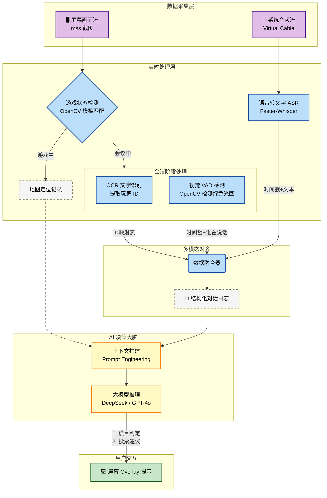
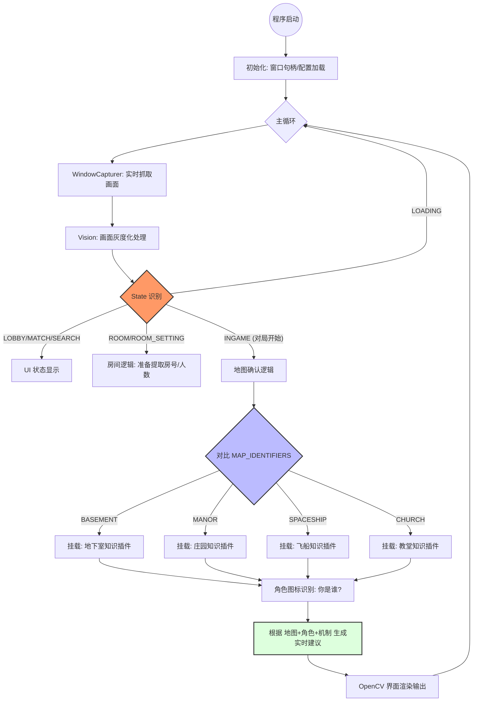

---

excalidraw-plugin: parsed
tags: [excalidraw]

---
==⚠  Switch to EXCALIDRAW VIEW in the MORE OPTIONS menu of this document. ⚠== You can decompress Drawing data with the command palette: 'Decompress current Excalidraw file'. For more info check in plugin settings under 'Saving'


# Goose Goose Duck




# GooseMind

理顺了！为了让你更直观地看到这个“鹅鸭杀辅助”的指挥体系，我为你生成了一份 **Mermaid** 格式的流程图。

这份图表涵盖了从**窗口采集**到**场景分发**，再到你刚才要求的**地图确认**以及后续**角色/任务插件**的完整逻辑架构。



### 1. 流程图逻辑说明（理顺关键点）

* **双层过滤系统**：
* **第一层**：先认场景（LOBBY, ROOM, INGAME）。这样可以避免在房间里乱跑地图识别逻辑，节省 CPU。
* **第二层**：进入 `INGAME` 后，触发 `MAP_IDENTIFIERS` 的指纹比对，精准锁定四个地图之一。


* **优先级阻断**：
* 你在图中可以看到，`ROOM_SETTING` 会在 `ROOM` 之前被判定（虽然图中简化了分支），确保弹出框不会被漏掉。


* **模块化扩展**：
* 最后的“Advice（实时建议）”是一个开放接口。等我们把地图和角色都认准了，这里就可以接入你说的“20多种角色机制”和“地图特殊任务”手册。


---

### 2. 逻辑进度确认

目前我们已经完成了图中**上半部分**的所有场景识别（6个 Key 完美对齐），现在正停在**“地图确认逻辑”**的门口。

**这份流程图符合你脑海中的构思吗？如果你觉得逻辑顺了，我们下一步就按照 `MAP_IDENTIFIERS` 的清单，把那四个地图的“指纹识别”代码实装到 `vision.py` 中，如何？**

# Excalidraw Data

## Text Elements
## Element Links
JOlDbZBq: [[Tools/鹅鸭杀神算子/Drawing 2026-01-27 00.33.35.excalidraw.md#Goose Goose Duck]]

u4Pd8KMz: [[Tools/鹅鸭杀神算子/Drawing 2026-01-27 00.33.35.excalidraw.md#GooseMind]]

%%
## Drawing
```compressed-json
N4KAkARALgngDgUwgLgAQQQDwMYEMA2AlgCYBOuA7hADTgQBuCpAzoQPYB2KqATLZMzYBXUtiRoIACyhQ4zZAHoFAc0JRJQgEYA6bGwC2CgF7N6hbEcK4OCtptbErHALRY8RMpWdx8Q1TdIEfARcZgRmBShcZQUebQBGAHZtHho6IIR9BA4oZm4AbXAwUDBSiBJuCAApAHl8ABFNAC0AIQBHNNLIWERKzM0EYmJcTWDOssxuZwBWAA446f4ymCnE

te0AFgBmRMWiyAoSdW54nl2lyEkEQmVpE4A2HgBOC4hrZTG0e5TZgAYNp5nJ6zWZrLbxeKvZhQUhsADWCAAwmx8GxSJUAMS/bE48aQTS4bBw5SwoQcYjI1HoiQw6zMOC4QI5PEQABmhHw+AAyrBPuhJISNIEWdDYQiAOpHSQnKEw+EIHkwPkQQQeFmk24ccJ5NCQ/YQNgM7BqFa67GvUnkrXMHWoDhCTlQhCDE5zaYvfWMFjsLhoLY8e6vL2sTgA

OU4YldEN+8Xu92mfH1QjgwygLt1iXuTw2G2mG3iszzeq65WY9QyaeI3FZBDCrxJwjgAEliLb8gBdV6aYTkgCiwSyOTbnf1RA4cMq+XyABU2CiIoBRPMAtHmAAXNAHqegHTvQAK2gp6uRDhxlLxfgHnDHnGdUNjtFstjfpto3AQSPvtPpiBiAOJzsKob9sX96iEIl23bFlUSJdNUBrfA631VlyCyFtuHtR19WYdxxFQQoujAYsunifYRxLbAhGhAx

6lwKJuBKEt3wABVhOQaP2MoyIQGp7BIJxyxrB1cmrWsEAuMoCSJBsyWIABZKjsEkRFrHoUJBNg4TWPxQliUtaTZMkftMmyKBuBhIQ1NwjTxO0yk0UxVk7LxUTNIk8kaiNE1uHuX4RPxNFiCYGSoDk/TByMtATLM3CIG7Ug/NIazqXQDE7NZByfJiphXMJdy0C89S2Q5bJcCyAA1QhWFGLCYLCViAF99hq15CHJLBKlwX4ICKBqiloyAKgkIQNno4

hZgAaSkowWR6LCMH0AYhhGMZXkmNBnESeI7w2GNpizeINkSDY40DfVTVQU45m0J54gTAM4yeYFY1eQ5iGOXUtlmb4eA2HhbzerZfndeZXiuG47l1J4tgfWMeFjLZ4zzaZfkSV53j5XKS1FeV4sxHFcS7JyrJRGyaXIDh6UZQyWXZTlFWVAU5JEJBZTFBBJWe6VdSZ+Uaem1UKgtYRNW1GV9UNLLYBOc19W061bVQ/AnSgkEiyDJgQ19VBwT2Etgx

9cMOEjNAeD+WYnm2/5XmTVMoKSLMc2mTMvp4LWyjK8tgkrFS4JLCTm1bApiNEntiGCwzh1eMcJwkKdZ3nBRl3Xbdd33Jqjx4E97jPeIL0SK9fhvO8IcfHBn08Cg3w/f8wikpriFA8C2Egqs0CqiLIAQoqEGQtA5ahTCClY/DSkIroA8gUjyP0SjqLQHrIAYpjbVnyB2M4hweIQPj8AE5uhO8qL8aDgK5IUjglNtFu97ErTD90kPmTC0hTMvg/JKx

iQkvs5/LKDzLjXFr40aRWirFI+ekBwUwfk/PKwCmBv0SslVKUVfIZTcv/K8e8qaFRKmVQgFVPYIFqvVRqzVlroFwPEDqpQ6pgGIm8OAcAeRUSwrRaAVwsiVCILcIySwGCEAQBQFoL9yRwIgB/ZKKUeGkVIEyKATY0z6B5MzERGJ4gIFUao8YEApEyLkZkQR39X6EwStAEmZMZGaO0YZXR+gABiHJuS8h5iiPmRQtEiB0fIxR8pWYvV4JI9xVjPFy

gRNzSovMqz+OkYEzIAAlAWkgZbCzKJYnI1jf7ZVOpLZJATUnyJsZwKANiiochOs7NxUTcmZHyTkLkhAjBYTTpEjxmRpxYCgAAQU4erCAwRWTcNcSk2RQTGQdOkWwCgVxcBNztA6eWAyclDMyL2ck7SxkTJCNMt4ayLELOsas2EFBpzwGmtpHZFTFm2MQggOJfIe6uIwrCTkAANbgsx4h50SIWRIsMzh5jjLMHhDyUT4AAJpTFOPcWY2hIX/R2G9A

Mf0tg8KMHOfQLFtYEFMtwPOl1Eb/U6k06J+g4mSUSRIU5PCSQkFqfU7gjTXFUuIDyBAcBuBlMZVJNgfllkLSghfBlpASBwJ6hAFoKJNmkGUASAAFNDJGvAkjUAVfKvO0wACULIYkIGUA6RklRJUyu+l5Xgf0lVGqVaqjVBL5nnK8QiVyUAfSy1mTw9uWQtXNUFYedFZRCoVWmeFV42AiCssga3CAHAO7GUfuG4QUAxxYUDfqfQjIESkFDFGsNrwU

2kDTTy/10bTLWrKHYAAVggbAuQuSRrgJy7lkaC071UjwwkjrGAx3wD67oxywkZErT6Fk48oAGCOb0buLrRwNwRNM/lJYEIGC5H2x1nB8Hh1CB0/t7a5ydvHZyYtkBHDMF5ciHIbSpLZCEPg8AXU24FUXnVGqQA==
```
%%