---

excalidraw-plugin: parsed
tags: [excalidraw]

---
==⚠  Switch to EXCALIDRAW VIEW in the MORE OPTIONS menu of this document. ⚠== You can decompress Drawing data with the command palette: 'Decompress current Excalidraw file'. For more info check in plugin settings under 'Saving'


# Goose Goose Duck

```mermaid
graph TD
    %% 定义样式 - 适配 Obsidian 深色/浅色模式的通用配色
    classDef input fill:#E1BEE7,stroke:#4A148C,stroke-width:2px,color:#000;
    classDef process fill:#BBDEFB,stroke:#0D47A1,stroke-width:2px,color:#000;
    classDef logic fill:#FFF9C4,stroke:#F57F17,stroke-width:2px,color:#000;
    classDef output fill:#C8E6C9,stroke:#1B5E20,stroke-width:2px,color:#000;
    classDef storage fill:#F5F5F5,stroke:#616161,stroke-width:2px,stroke-dasharray: 5 5,color:#000;

    %% 输入层
    subgraph Inputs [数据采集层]
        Screen[🖥️ 屏幕画面流<br/>mss 截图]:::input
        Audio[🎤 系统音频流<br/>Virtual Cable]:::input
    end

    %% 处理层
    subgraph Processing [实时处理层]
        %% 视觉分支
        direction TB
        StateCheck{游戏状态检测<br/>OpenCV 模板匹配}:::process
        
        Screen --> StateCheck
        
        subgraph MeetingPhase [会议阶段处理]
            OCR[OCR 文字识别<br/>提取玩家 ID]:::process
            VisualVAD[视觉 VAD 检测<br/>OpenCV 检测绿色光圈]:::process
        end
        
        StateCheck -- 游戏中 --> MapLoc[地图定位记录]:::storage
        StateCheck -- 会议中 --> MeetingPhase
        
        %% 音频分支
        ASR[语音转文字 ASR<br/>Faster-Whisper]:::process
        Audio --> ASR
    end

    %% 数据融合层
    subgraph Alignment [多模态对齐]
        Merger(数据融合器):::process
        VisualVAD -- "时间戳+谁在说话" --> Merger
        ASR -- "时间戳+文本" --> Merger
        OCR -- "ID映射表" --> Merger
        
        Transcript[📝 结构化对话日志]:::storage
        Merger --> Transcript
    end

    %% 逻辑大脑层
    subgraph Brain [AI 决策大脑]
        Context[上下文构建<br/>Prompt Engineering]:::logic
        LLM[大模型推理<br/>DeepSeek / GPT-4o]:::logic
        
        MapLoc -.-> Context
        Transcript --> Context
        Context --> LLM
    end

    %% 输出层
    subgraph UI [用户交互]
        Overlay[💻 屏幕 Overlay 提示]:::output
    end

    LLM -- "1. 谎言判定<br/>2. 投票建议" --> Overlay
```



# Excalidraw Data

## Text Elements
## Element Links
JOlDbZBq: [[Tools/鹅鸭杀神算子/Drawing 2026-01-27 00.33.35.excalidraw.md#Goose Goose Duck]]

%%
## Drawing
```compressed-json
N4KAkARALgngDgUwgLgAQQQDwMYEMA2AlgCYBOuA7hADTgQBuCpAzoQPYB2KqATLZMzYBXUtiRoIACyhQ4zZAHoFAc0JRJQgEYA6bGwC2CgF7N6hbEcK4OCtptbErHALRY8RMpWdx8Q1TdIEfARcZgRmBShcZQUebQBGAHZtHho6IIR9BA4oZm4AbXAwUDBSiBJuCAApAHl8ABFNAC0AIQBHNNLIWERKzM0EYmJcTWDOssxuZwBWAA446f4ymCnE

te0AFgBmRMWiyAoSdW54nl2lyEkEQmVpE4A2HgBOC4hrZTG0e5TZgAYNp5nJ6zWZrLbxeKvZhQUhsADWCAAwmx8GxSJUAMS/bE48aQTS4bBw5SwoQcYjI1HoiQw6zMOC4QI5PEQABmhHw+AAyrBPuhJISNIEWdDYQiAOpHSQnKEw+EIHkwPkQQQeFmk24ccJ5NCQ/YQNgM7BqFa67GvUnkrXMHWoDhCTlQhCDE5zaYvfWMFjsLhoLY8e6vL2sTgA

OU4YldEN+8Xu92mfH1QjgwygLt1iXuTw2G2mG3iszzeq65WY9QyaeI3FZBDCrxJwjgAEliLb8gBdV6aYTkgCiwSyOTbnf1RA4cMq+XyABU2CiIoBRPMAtHmAAXNAHqegHTvQAK2gp6uRDhxlLxfgHnDHnGdUNjtFstjfpto3AQSPvtPpiBiAOJzsKob9sX96iEIl23bFlUSJdNUBrfA631VlyCyFtuHtR19WYdxxFQQoujAYsunifYRxLbAhGhAx

6lwKJuBKEt3wABVhOQaP2MoyIQGp7BIJxyxrB1cmrWsEAuMoCSJBsyWIABZKjsEkRFrHoUJBNg4TWPxQliUtaTZMkftMmyKBuBhIQ1NwjTxO0yk0UxVk7LxUTNIk8kaiNE1uHuX4RPxNFiCYGSoDk/TByMtATLM3CIG7Ug/NIazqXQDE7NZByfJiphXMJdy0C89S2Q5bJcCyAA1QhWFGLCYLCViAF99hq15CHJLBKlwX4ICKOqwGIt44DgHkqKw2

joCuLJKiIW4jKWBhCAQCgWicqyURsiQkuS+zptI0gmSgJs030HkxSRZaEogDF4gQC6LvGCAtp2vbMgWyyewpE7KlpDh6UZQybruwyHv0AAxDluV5LCVRRCpNpEe79sO+VJWIY40ETMo/pyAH4YRRVlVVKGilumH/v2gAlYRNW1GUCfR3b9sy41YBOc1qaJjH9sBzgoEBoqOVNVA9jR1nacyDmci5QgjCwnhcsF7bicyacsCgABBCbfXQYJWSmlm5

bZzIBtIFXtrYCgrlwKs0FQ/Bod14X9F7clleN02Qgt9BGVhKgbdhzInc96d4HB7TfqFgHAcQhAyb5K3pow2FOQADW4RJb1j7B4/wABNbgnmmb4854AXICMOd9BYkslN8LDCNKBqdZ9/Qyck61bQgYPppJEhxcl7hpY70gu7TOBuCLiBO+ktg/IdkZgjdqqIrHgfXqpcuyhaFE3bb5QCQACh4JJqF4A+j8SQ/fm0aYAEoWRJhBlAdRlKlIbfcD3rY

vN4d/D54L+rwv6/Ore0MljDicAoA+ltDHAmCEiqR2yLFJqyhV6QEKhVN24VXjYCIMPMKpBTKvA4LA4yeCIqQGEFAMcWEMH6n0IyBEpBQxENwfgmhdCmDTzQcQ0ygCCZ2AAFYIGwLkLkhC4BSUnggDhs8VJwTKIScBjBZwomQdAQOlQwjBCET6FkpFyL6ADr0S2DprajjYJBOeQlXgIQMFyDIWjOAyNIRAfAoQVZaMUXOfAKFjE8LKI4ZgM9jo5CV

lJbIQhHHgDrpAdkwRbTADqjVIAA=
```
%%