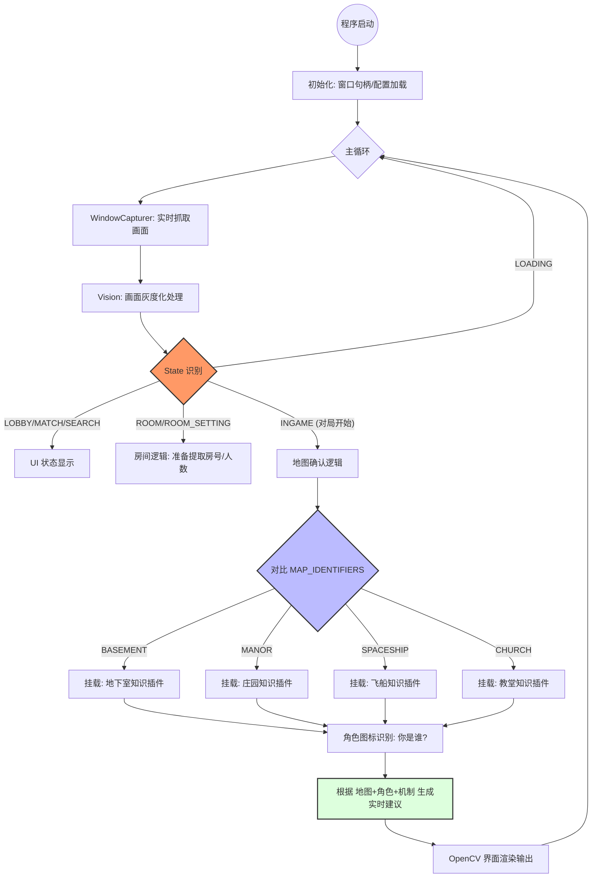

---

excalidraw-plugin: parsed
tags: [excalidraw]

---
==⚠  Switch to EXCALIDRAW VIEW in the MORE OPTIONS menu of this document. ⚠== You can decompress Drawing data with the command palette: 'Decompress current Excalidraw file'. For more info check in plugin settings under 'Saving'


# Code Block

理顺了！为了让你更直观地看到这个“鹅鸭杀辅助”的指挥体系，我为你生成了一份 **Mermaid** 格式的流程图。

这份图表涵盖了从**窗口采集**到**场景分发**，再到你刚才要求的**地图确认**以及后续**角色/任务插件**的完整逻辑架构。



### 1. 流程图逻辑说明（理顺关键点）

* **双层过滤系统**：
* **第一层**：先认场景（LOBBY, ROOM, INGAME）。这样可以避免在房间里乱跑地图识别逻辑，节省 CPU。
* **第二层**：进入 `INGAME` 后，触发 `MAP_IDENTIFIERS` 的指纹比对，精准锁定四个地图之一。


* **优先级阻断**：
* 你在图中可以看到，`ROOM_SETTING` 会在 `ROOM` 之前被判定（虽然图中简化了分支），确保弹出框不会被漏掉。


* **模块化扩展**：
* 最后的“Advice（实时建议）”是一个开放接口。等我们把地图和角色都认准了，这里就可以接入你说的“20多种角色机制”和“地图特殊任务”手册。


---

### 2. 逻辑进度确认

目前我们已经完成了图中**上半部分**的所有场景识别（6个 Key 完美对齐），现在正停在**“地图确认逻辑”**的门口。

**这份流程图符合你脑海中的构思吗？如果你觉得逻辑顺了，我们下一步就按照 `MAP_IDENTIFIERS` 的清单，把那四个地图的“指纹识别”代码实装到 `vision.py` 中，如何？**

# Excalidraw Data

## Text Elements
%%
## Drawing
```compressed-json
N4KAkARALgngDgUwgLgAQQQDwMYEMA2AlgCYBOuA7hADTgQBuCpAzoQPYB2KqATLZMzYBXUtiRoIACyhQ4zZAHoFAc0JRJQgEYA6bGwC2CgF7N6hbEcK4OCtptbErHALRY8RMpWdx8Q1TdIEfARcZgRmBShcZQUebQBGAHZtHho6IIR9BA4oZm4AbXAwUDBSiBJuCABRegA1dQAlABUABTTSyFhESszNBGJiXE1g9rLMbmcAVgAGAGZtSf4ymAmA

FlmATm11xMWiyAoSdW54+IA2VaXISQRCZWluDcnL/YhrZRG0aauIZihSNgAawQAGE2Pg2KRKgBiaZw+GjSCaXDYQHKAFCDjEMEQqESf7WZhwXCBHKIiAAM0I+HwAGVYJ90JIURpAuS/gDgQB1I6SE4/DlAhD0mCM37gio/DH3DjhPJoeI/NjE7BqFYKuFS4RY2XMeWoDhCGkChD9biJM48b6vRgsdhcNCzPg2pisTgAOU4YnNkw2G1Wq0mPBeHQg

QjggygZoVFv9qzO0wAHLNJrNFa9CMwACIZKPEbj/IQIH7o4RwACSxH1+QAuj9NNriFVglkctW668iBxAZV8vkmmxwRFAKJ5gFo8wAC5oA9T0A6d6ABW0FABxQdhACyhCxgFD4wCVSoBBW0A0F6AP7VtPpiNCwcQEKgAEIQ1E1mvk2/A/NoCkEMI/CnkLKV7iG42vMw7jiKghQdGA6bgfE+wdqG2BCH8BhZrgUTcCUoYni0AJyGh+xlAhCAAPL2CQ

Tg5m+Rq5Nwb74B+eFIiiaIYliK4odgkggtY9ChNR77FvREDIqipaYsQrFQOxzaZNkUAFqQRZXGUQlMY2OKQjCFKaYiSmMSJWKESqarcAmilIpCF6kOJkktjJckKQJDakBZal4ug0KaRS2lmU5TAGSiRlfKZlLUtkuBZLUmaEMMIE0WEeEAL77PFPzrhe4wSLg0wQEUiVgLBbxwHA9IoSB6HQDcWSVEQ9yyUsDCEAgFBXrpzHYuC6kSO5HlaXV8Gk

KSUDllG+j0pyoLta5EDQvECAzTNowQH1A1DZkzXCa1LmVASHBEiStm9SIy3DQAYtSdIMiB4oeAtS0yStI3/EKPLEMcaDOmUt05Pdo1CiKYqCNdB39Xdw0NMIMpyvyRSLYdIOZH5qqwCcmrQ59g0nZwUDHWF1LqqgewfbDX0YzktKEEYIFWkDR2ZE0WBQAAgtVDroMEFK1ajRPo5kxWkIz/VsBQNy4C+BpGvg1Nw/oVRYgzAtCyEotvPLN1c/dcsA

hQTTwJdrWq8DxOZMd34IGDjL/hL0NAQCNIABrcKmqwJGmqzTGckynAGAZ1db4L4AAmuaZzxNoGzxBsmwJmmHsbO9kBGIO+i4aG3G+CBIfhxciSJjlkuG/oYOibq+oQHrdXoiQZMU9wVPQxXxD0ggcAO+XpAkCubAXjLQzBKLsX8WU9ebWg6GQFe4JK6QyjIgAFDwSTULwC9L4ki/TAsACU5INAgyhGiSlRT7PPCzN8vCn4vJ9n+vkxb7nnMG1AP3

AgZUD2vqFt1V+YWm9kFnrsoZOZRQrRVFoWAeH0iDNzQOAn4HAf52QgZAYQUAuwgVga8fQJJgSkHdAgmB8kkEQCwaQHB3dQGIPvmUOwAArBA2Bci0ngXADuXd4EUNfHxOqKI36MAHOCIBnQdaVDCMEBh9pyTwUQvobW3Q0Cf07GwVE0ZUD90/ACEaGRxGcF4rRIh+BQiM3EXwwc+A/ziyoZARwzAe7jRyPTFc2QhC6LimAZKdAqTBH1MARK8UgA==
```
%%