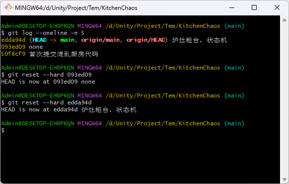

## 🛠️ Git 版本管理实操笔记

在 Unity 开发过程中，如果代码写乱了或者想找回之前的版本，可以使用以下命令。

## 1. 查看提交历史

在执行任何回退操作前，先确认当前所处的版本 ID。

Bash

```
git log --oneline -n 5
```

> **你的记录示例：**
> 
> - `edda94d` (HEAD -> main) 炉灶柜台，状态机（当前有问题版本）
>     
> - `093ed09` none（目标回退版本）
>     

---

## 2. 执行回退（回到上一个版本）

如果你确定当前版本不可用，想彻底回退：

**命令：**

Bash

```
git reset --hard [版本ID]
```

- **示例：** `git reset --hard 093ed09`
    
- **注意：** `--hard` 会清空你本地所有未提交的修改，执行前请保存好 Unity 场景。
    

---

## 3. 撤销回退（后悔了，想找回刚才删掉的版本）

即便执行了 `reset --hard`，Git 依然有“后悔药”。

#### 方法 A：使用已知 ID（最快）

如果你还记得之前的 ID（如你的 `edda94d`）：

Bash

```
git reset --hard edda94d
```

#### 方法 B：查看操作日志（万能法）

如果 ID 找不到了，输入：

Bash

```
git reflog
```

你会看到类似下面的记录：

> `093ed09 HEAD@{0}: reset: moving to 093ed09` <-- 当前位置
> 
> `edda94d HEAD@{1}: commit: 炉灶柜台，状态机` <-- 想要找回的位置

然后执行：

Bash

```
git reset --hard HEAD@{1}
```

---

## 4. 同步到 GitHub 远程仓库

当你确定本地版本已经调整好后，需要更新云端仓库：

- **强制覆盖云端：** `git push -f origin main`
    
- **拉取云端覆盖本地：** `git reset --hard origin/main`
    

---

## ⚠️ Unity 项目特别注意

1. **Meta 文件同步：** 回退版本后，Unity 会检测到大量文件变化并重新导入（Importing...），请务必等右下角进度条跑完再运行游戏。
    
2. **关闭编辑器：** 大规模回退版本（跨度超过 3 个 commit）时，建议先关掉 Unity，回退完再开，防止 Prefab 引用丢失。
    
