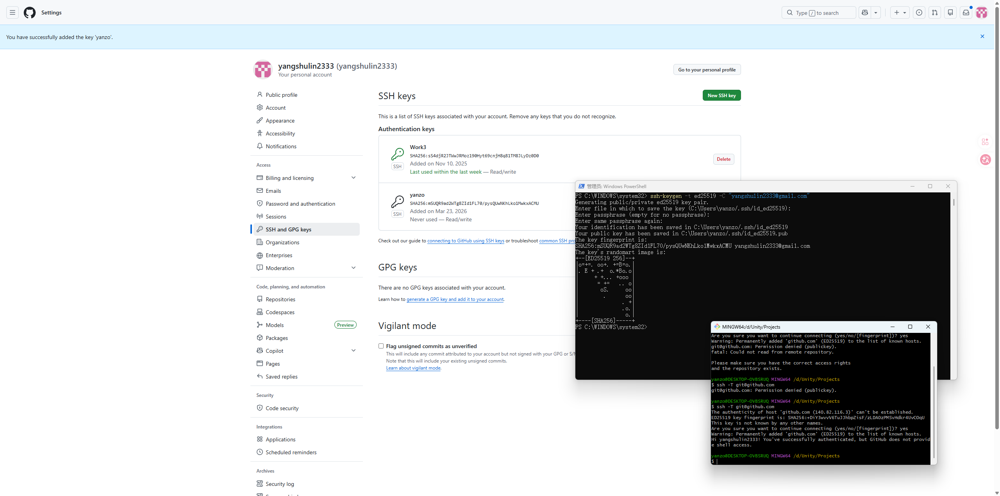

初始化
```
git config --global user.email "yangshulin2333@gmail.com"

git config --global user.name "yangshulin2333"
```


## 1. 生成新的 SSH Key

打开终端（PowerShell 或 CMD），输入：

Bash

```
ssh-keygen -t ed25519 -C "yangshulin2333@gmail.com"
```

- **一路回车**（不需要设置密码，除非你自己想设）。
    
- 这会在 `C:\Users\你的用户名\.ssh\` 目录下生成两个文件：`id_ed25519`（私钥）和 `id_ed25519.pub`（公钥）。
    

## 2. 获取公钥内容

在终端输入以下命令查看并复制公钥：

PowerShell

```
cat ~/.ssh/id_ed25519.pub
```

- 选中并复制以 `ssh-ed25519` 开头的整行内容。
    

## 3. 将公钥添加到 GitHub

1. 登录你的 GitHub，点击右上角头像 -> **Settings**。
    
2. 左侧菜单找到 **SSH and GPG keys**。
    
3. 点击 **New SSH key**。
    
4. **Title** 随便起（比如 "Win11-Home"），**Key** 粘贴你刚才复制的内容。
    
5. 点击 **Add SSH key**。
    

## 4. 测试连接

回到终端，输入：

Bash

```
ssh -T git@github.com
```

- 看到 `Hi yangshulin2333! You've successfully authenticated...` 就说明配置成功了。
    
