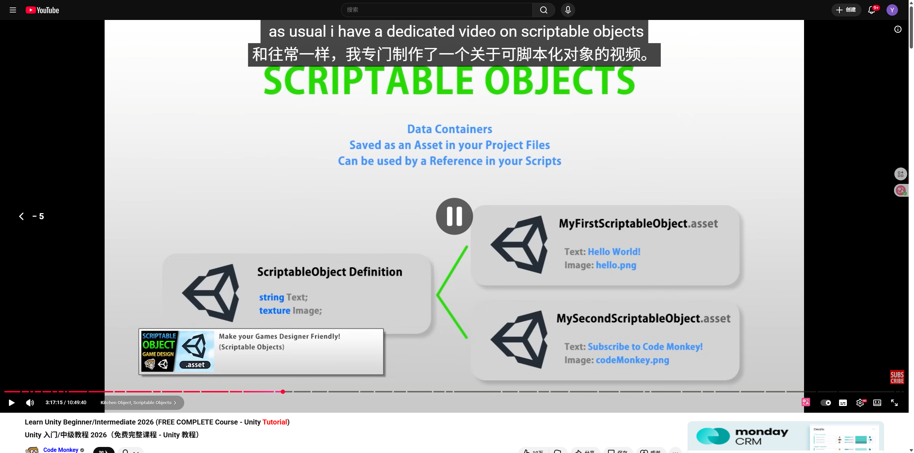
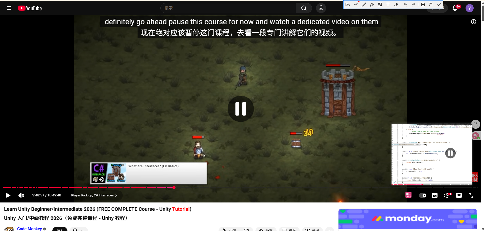

# 交互

# Delegrates

# Events

# 可脚本化对象

### 1. 什么是 Scriptable Object？

- **数据容器 (Data Containers):** 它就像一个用来装数据的“箱子”。它不存逻辑（怎么移动、怎么攻击），只存数据（名字、血量、图标、模型预制体）。
    
- **作为资产保存在项目中 (Saved as an Asset):** 普通的脚本（MonoBehaviour）必须挂在场景里的物体（GameObject）上才能运行。但 Scriptable Object 不用挂在物体上，它像图片、音频文件一样，是一个**存在于文件夹里的文件**（后缀通常是 `.asset`）。
    
- **被脚本引用 (Used by a Reference):** 你的游戏脚本可以读取这些文件里的数据。
    

### 2. 为什么要用它？（他在图里展示的结构）

看图中间的逻辑：

- **左边 (ScriptableObject Definition):** 你写一份代码（比如 `KitchenObjectSO`），定义这个物体有哪些属性（比如：名字 `string Name`，图标 `Sprite Icon`）。这就好比你在设计一张“表格模板”。
    
- **右边 (Asset Instances):** 基于这个模板，你在 Unity 编辑器里右键创建出很多个具体的文件。
    
    - 文件 1：**番茄 (Tomato)** —— 名字叫"Tomato"，图标是红色的图。
        
    - 文件 2：**奶酪 (Cheese)** —— 名字叫"Cheese"，图标是黄色的图。
        

### 3. 在这个教程里他是要干嘛？

在这个《厨房混乱》游戏里，他即将用 Scriptable Objects 来定义所有的**食材**。

- 他不想给番茄写一个脚本，给奶酪写一个脚本。
    
- 他会写**一个**通用的 `KitchenObjectSO` 模板。
    
- 然后创建一堆数据文件：`Tomato_SO`, `Cheese_SO`, `Bread_SO`。
    
- 这样以后要加新菜（比如生菜），只要在编辑器里右键新建一个文件，填上名字和模型，游戏里就有了，**完全不用写新代码**。这就是截图里那个小标签写的 **"Make your Games Designer Friendly" (让策划也能轻松做游戏)**。
    

### 4. 字幕里的那句话

字幕说：“和往常一样，我专门制作了一个关于可脚本化对象的视频。”

- 意思是：Scriptable Object 这个概念非常深、非常有用，他在这个教程里只会讲怎么在这个游戏里用。
    
- 如果你想深入了解它的所有高级用法（比如做存档系统、事件系统），他在他的频道里有另一个专门的视频详细讲这个。但在本教程里，你跟着他操作，学会怎么用它定义食材就够了。
    

**简单总结：他是在教你如何把“数据”（食材属性）和“逻辑”（切菜动作）分开，让管理游戏物品变得超级简单。**

# 接口
