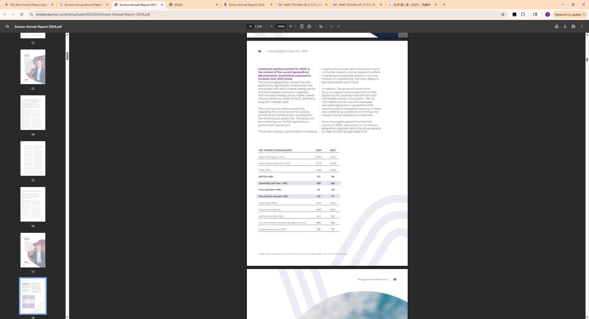

## Annual Revenue

截图中的 **"KEY FIGURES CONSOLIDATED"** 表格清晰显示：

- **Sales (2024):** **3,766 M€**（约 3.8 亿欧元，与我提到的数据吻合）。
    
- **Net profit (2024):** **193 M€**（与我提到的数据一致）。
    
- **Core Markets:** 截图上方文字也明确提到了 **Luxembourg, Germany, Belgium, the Netherlands and France**。

## Countries covered

## Population of total coverage

## Evs (Leasing)

## EVSE

## BESS

## PV/Solar

## Heat pumps

## Time of use Tarrifs

## Type of use tariffs

## V2G Tarrifs

## Domestic

## Private (office, fleets)

