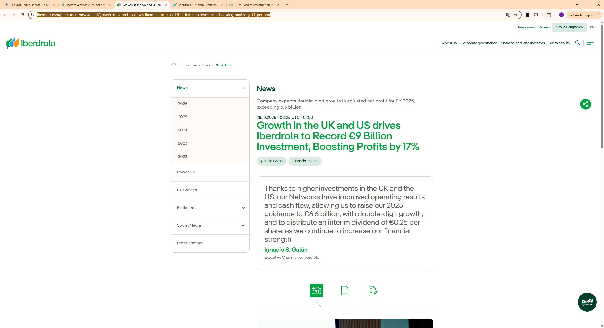

## Annual Revenue

### 截图直接证明的核心要点：

1. **2025 全年利润指引 (Guidance)：** 截图明确显示“Company expects... exceeding **6.6 billion**”，这验证了我们填写的指引上调至 66 亿欧元的准确性。
    
2. **利润增长率：** 标题直接给出了 **“Boosting Profits by 17%”**（利润增长 17%），这说明其在 2025 年的盈利效率极高。
    
3. **投资规模：** 证实了公司在 2025 年前三季度的投资额达到了创纪录的 **€9 Billion**（90 亿欧元）。
    
4. **分红政策：** 确认了中期股息（Interim dividend）提高到了 **€0.25/每股**。
    
5. **核心增长动力：** 截图开篇就提到了 **"Growth in the UK and US"**（英美市场的增长），这印证了我们之前说的其重心正在向受监管电网资产转移。

## Countries covered

## Population of total coverage

## Evs (Leasing)

## EVSE

## BESS

## PV/Solar

## Heat pumps

## Time of use Tarrifs

## Type of use tariffs

## V2G Tarrifs

## Domestic

## Private (office, fleets)

