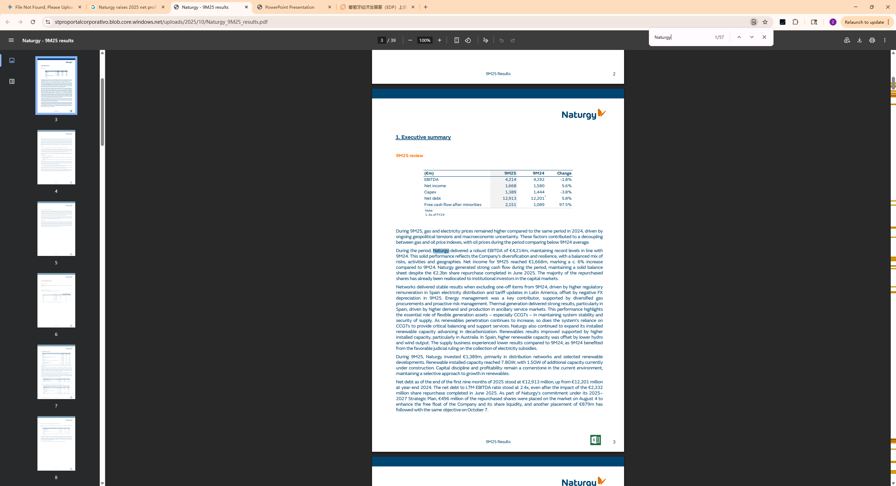

## Annual Revenue

是的，您提供的 **`image_79f973.jpg`** 正是证明 **Naturgy 2025 年前九个月 (9M25) 财务表现** 的核心截图。

- **证据核实：** 该截图显示的“Executive summary”明确列出 9M25 的 **EBITDA 为 4,214 百万欧元**（即 42.14 亿），**净利润（Net income）为 1,668 百万欧元**（约 16.7 亿），同比增长约 6%。
    
- **区分提醒：** 之前的 `image_792a06.jpg` 是关于 **EDP** 的指引，请在填写 Excel 时注意区分这两份证据。

## Countries covered

## Population of total coverage

## Evs (Leasing)

## EVSE

## BESS

## PV/Solar

## Heat pumps

## Time of use Tarrifs

## Type of use tariffs

## V2G Tarrifs

## Domestic

## Private (office, fleets)

