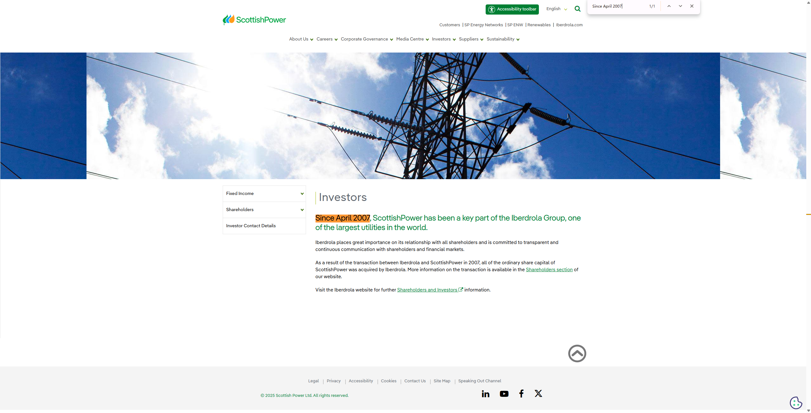

ScottishPower 已经在 2007 年退市，成为了 **Iberdrola（西班牙伊贝德罗拉集团）** 的全资子公司。

## Annual Revenue

## Countries covered

## Population of total coverage

## Evs (Leasing)

## EVSE

## BESS

## PV/Solar

## Heat pumps

## Time of use Tarrifs

## Type of use tariffs

## V2G Tarrifs

## Domestic

## Private (office, fleets)

