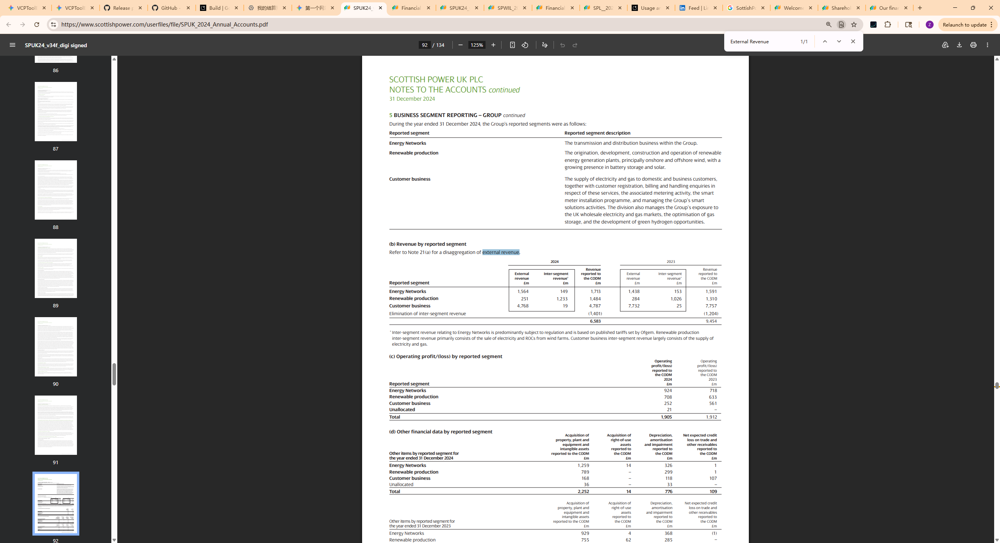
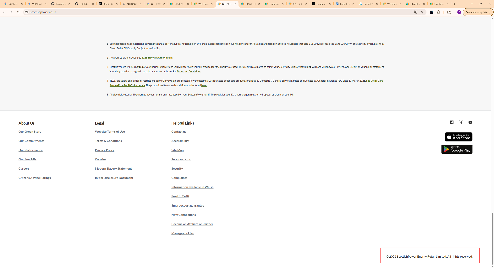
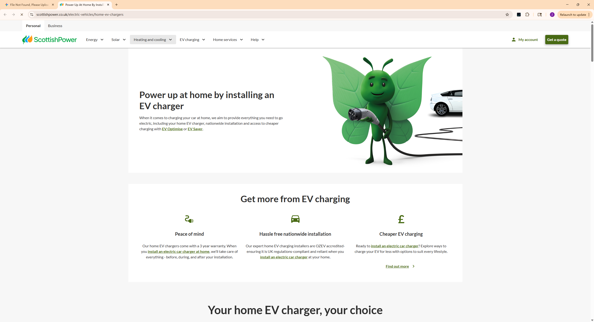
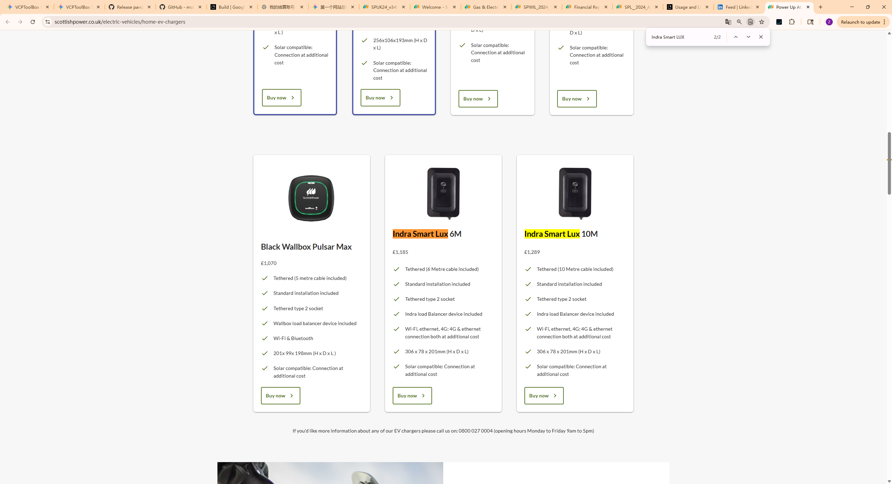
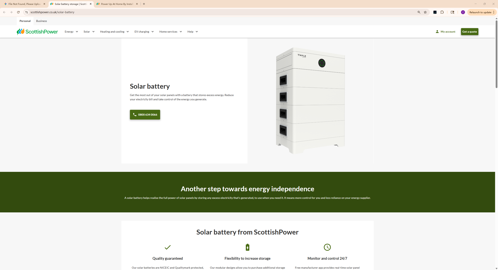
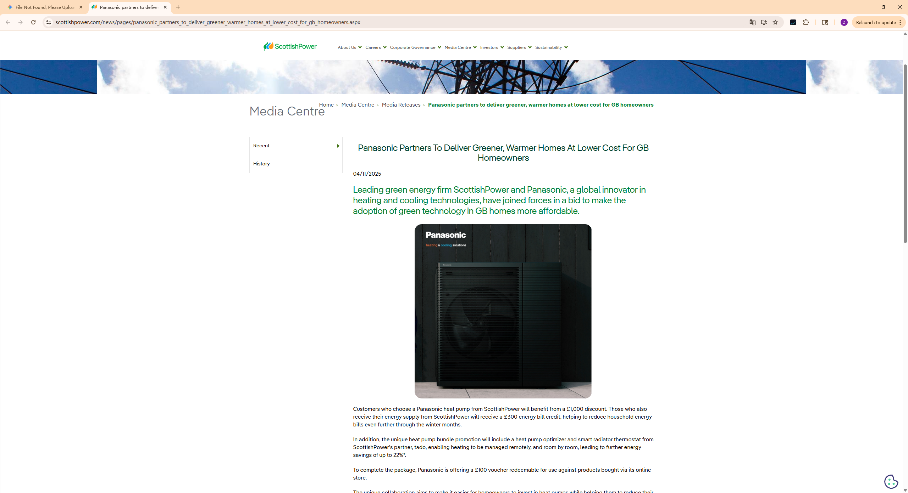
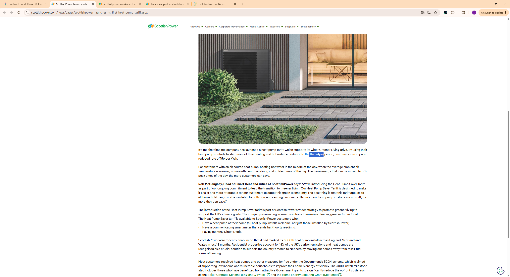

ScottishPower 已经在 2007 年退市，成为了 **Iberdrola（西班牙伊贝德罗拉集团）** 的全资子公司。

## Annual Revenue
（Page 89, Note 5），**Annual Revenue（年度营收）**

## Countries covered
只有UK

## Population of total coverage
**数据来源：ScottishPower 2023/24 战略报告。该数据包含家庭及商业客户账户。（注：其母公司 Iberdrola 全球服务人口约 1 亿，但 ScottishPower 独立实体约为 460 万）。**

## Evs (Leasing)

**观察页面顶部的导航栏或核心业务模块，你会发现只有以下三类：**

1. **Home EV Chargers** (家用充电桩 - 主要是卖 Wallbox Pulsar Max)
2. **EV Tariffs** (电动车电价 - 主要是省钱的夜间电费)
3. **Public Charging** (公共充电 - 通过 App 找充电桩)

**❌ 缺失项**： 完全找不到类似 "Lease an EV"（租赁电动车）或 "Buy an EV"（购买电动车）的入口。

## EVSE
官网现在同时销售 **Indra Smart PRO** 和 **Indra Smart LUX** 充电桩，旨在为用户提供更多选择（"gives even greater choice"）。

## BESS

寻找 "Modular design" (模块化设计) 和 "Capacity from 2.9kWh" (2.9度电起) 的描述，这正是 **Fox ESS ECS** 系列的独有规格。

## PV/Solar
第 2-3 页，可以看到关于 "Solar PV Panels" 的描述，虽然没写品牌，但写了 "Monocrystalline" (单晶) 和 "Smart Inverter" (智能逆变器)。

## Heat pumps

## Time of use Tarrifs
官方新闻稿，证明 11am-4pm 时段

## Type of use tariffs

## V2G Tarrifs

## Domestic

## Private (office, fleets)

