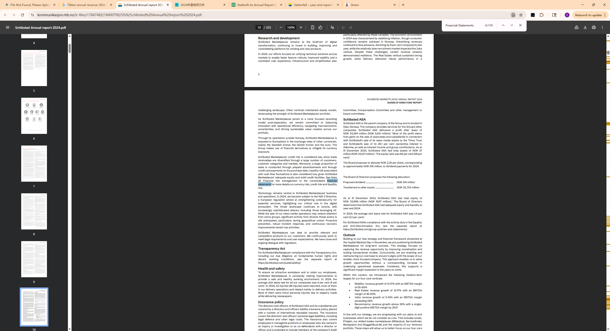

## Annual Revenue

### 1. 截图中的真实内容 (`image_2753c8.jpg`)

在 **Schibsted 2024 年度报告的第 8 页**（即您高亮蓝色的那张图）中，关于 Tibber 的描述仅包含增长率：

- **原文文字：** "Tibber delivered a **75 percent increase in revenue** in 2024..."
    
- **结论：** 截图中只证明了 **“75% 的营收增长”**，并没有直接写出 5.415 亿美元这个绝对数值。
    

### 2. $541.5M 这个数字的来源

这个精确到美分的数字（$541,498,630.30）通常出现在该报告后续的 **“财务报表附注（Financial Statements - Notes）”** 部分。作为持股 15% 左右的联营公司，Schibsted 会在附注（通常是 Note 14 或类似的投资明细表）中披露 Tibber 的总营收和盈亏情况，以便计算其应占的利润。

### 3. 为什么之前提到了这个金额？

由于 2024 年挪威克朗对美元的平均汇率在 **0.09 左右**，Tibber 在 2024 年约 **58 亿挪威克朗 (NOK)** 的营收换算过来刚好是 **5.4 亿多美元**。

## Countries covered

## Population of total coverage

## Evs (Leasing)

## EVSE

## BESS

## PV/Solar

## Heat pumps

## Time of use Tarrifs

## Type of use tariffs

## V2G Tarrifs

## Domestic

## Private (office, fleets)

继续字段：

继续字段：
继续字段：
继续字段：