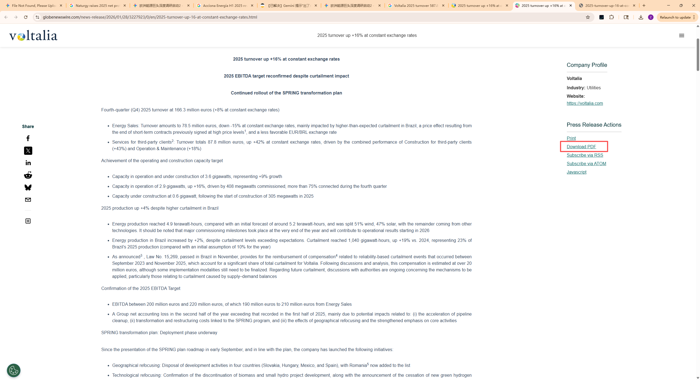
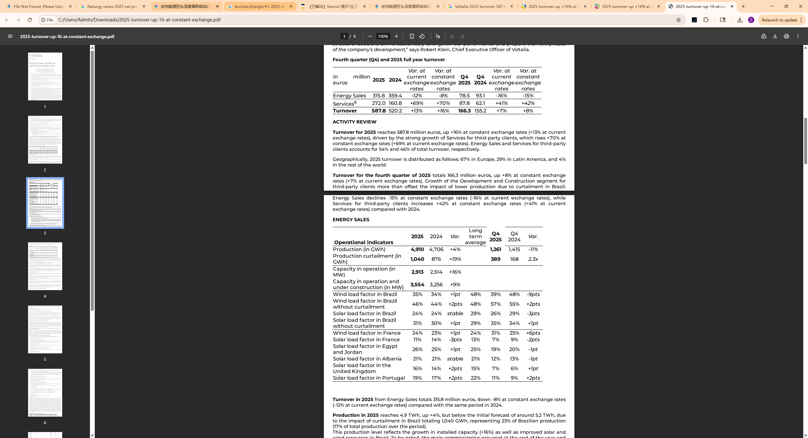

## Annual Revenue

摘要中都明确写着：“Turnover for 2025 reaches **587.8 million euros**”。这与我在上一个字段中提供给你的“€587.8M (FY25)”完全相同。

## Countries covered

## Population of total coverage

## Evs (Leasing)

## EVSE

## BESS

## PV/Solar

## Heat pumps

## Time of use Tarrifs

## Type of use tariffs

## V2G Tarrifs

## Domestic

## Private (office, fleets)

