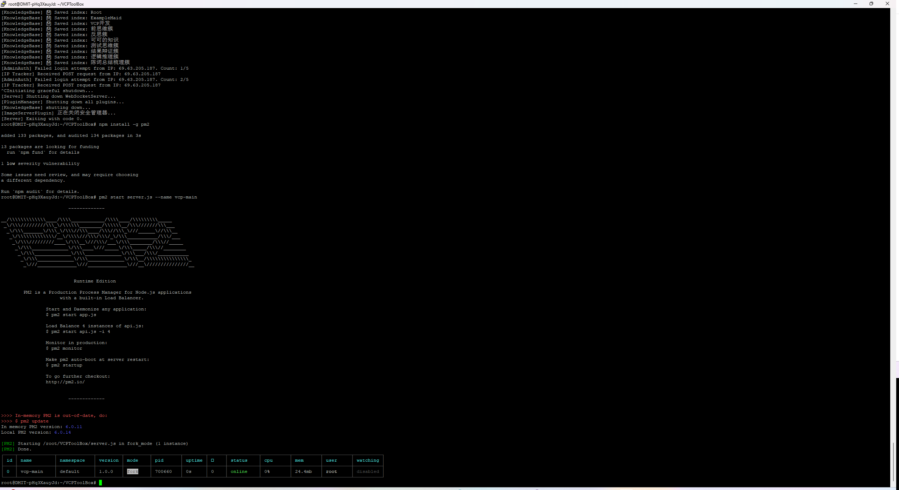

## 安装 NVM Node
curl -o- https://raw.githubusercontent.com/nvm-sh/nvm/v0.39.5/install.sh | bash
source ~/.bashrc

### 推荐安装 Node.js 20.x (这个版本兼容性最强)
- **安装 v20 版本**：
    ```
    nvm install 20
    ```
- **切换到 v20**：
    Bash
    ```
    nvm use 20
    ```
- **设为默认（防止下次开机变回旧的）**：
    Bash
    ```
    nvm alias default 20
    ```
- **验证一下**：
    Bash
    ```
    node -v
    ```

## Python安装
**Ubuntu 系统本身高度依赖自带的 Python 版本**。如果操作不当覆盖了系统默认版本，可能会导致你的 DMIT 服务器连 SSH 终端都无法正常登录。


为了安全且成功地在 Ubuntu 22.04/24.04 上安装 Python 3.10 并解决 `npm` 报错，请**严格按照以下步骤**执行：

### 1. 安装基础工具

先确保你的系统有添加第三方源的能力：

Bash

```
sudo apt update
sudo apt install software-properties-common -y
```

### 2. 正确添加 Python 源

现在运行这个命令，它会自动帮你配置好 Python 3.10 的下载地址。**注意：弹出提示时请按回车键确认。**

Bash

```
sudo add-apt-repository ppa:deadsnakes/ppa -y
sudo apt update
```

### 3. 正式安装 Python 3.10

现在系统就能找到包了，直接运行安装：

Bash

```
sudo apt install python3.10 python3.10-dev python3.10-venv -y
```

### 4. 解决 npm 之前的报错

安装好 3.10 后，你需要告诉 `npm` 编译时使用这个版本（这样就能绕过 Python 3.12 缺失 `distutils` 的问题）：

Bash

```
# 设置 npm 使用新安装的 python3.10
npm config set python /usr/bin/python3.10

# 回到项目目录重新安装
cd /root/VCPToolBox
rm -rf node_modules
npm install
```

### 5. 安装 VCP 的 Python 依赖

Node 依赖装好后，最后一步是安装 VCP 插件所需的库：

Bash

```
# 使用 python3.10 来运行 pip 安装
python3.10 -m pip install -r requirements.txt
```

**为什么这么做最稳？**

- **不破坏系统**：系统默认的 `python3` 依然是 3.12 保持不变，不会搞挂服务器。
    
- **精准编译**：`npm` 通过 `config set` 拿到了它想要的 3.10，这样 `better-sqlite3` 就能顺利编译通过了。

### pip安装
### 1. 安装 Python 3.10 的 pip 模块

Bash

```
sudo apt update
sudo apt install python3.10-distutils curl -y
curl -sS https://bootstrap.pypa.io/get-pip.py | sudo python3.10
```

_这一步会通过官方脚本为 Python 3.10 安装专属的 pip。_

### 2. 验证安装是否成功

运行以下命令，确认输出的版本信息里包含 `python 3.10`：

Bash

```
python3.10 -m pip --version
```

### 3. 继续安装 VCPToolBox 的 Python 依赖

一旦 pip 准备就绪，你就可以安装项目所需的依赖库了：

Bash

```
# 进入项目目录
cd /root/VCPToolBox

# 使用 python3.10 的 pip 安装依赖
python3.10 -m pip install -r requirements.txt
```

---

### 🛡️ 为什么不直接用 `apt install python3-pip`？

如果你直接用 `apt` 安装 pip，它通常会关联到系统默认的 Python 3.12。为了确保 VCPToolBox 运行在你刚配好的 **Python 3.10** 环境下，必须使用这种针对特定版本的安装方式。

**依赖安装完成后，你就可以尝试用 PM2 启动项目了。需要我帮你检查一下启动命令吗？**


## Config.env 内容修改


  
http://69.63.205.187:6005/AdminPanel


## **PM2** 

### 1. 为什么要搞 PM2？

你现在是通过 `node server.js` 手动运行的。

- **现状**：它占着你的黑框框（SSH 终端）。如果你把这个黑框框关掉，或者电脑断网了，**你的 VCP 网站立刻就会打不开**。
    
- **PM2 的作用**：它是一个“后台保姆”。它能把 VCP 变成一个系统服务，**即使你关掉 SSH、甚至重启服务器，VCP 都会一直在后台自动运行**。
    

---

### 🚀 把 VCP 变成“永久服务”的操作步骤

请回到你的 SSH 黑框框，按顺序执行下面几步：

#### 第一步：停止当前的手动进程

在那个还在刷日志的黑框框里，按键盘上的：

**`Ctrl + C`**

_(这一步会让网站暂时打不开，是正常的)_

#### 第二步：安装 PM2 工具（如果你还没装）

运行这行命令：

Bash

```
npm install -g pm2
```

#### 第三步：使用 PM2 启动 VCP

运行这行命令，告诉 PM2 接管 `server.js`：

Bash

```
pm2 start server.js --name vcp-main
```

_(看到这就说明启动成功了，你会看到一个绿色的 `online` 表格)_

#### 第四步：设置开机自启（重要！）

光启动还不够，要确保服务器重启后它也能自己活过来。

1. 运行：
    
    Bash
    
    ```
    pm2 save
    ```
    
2. 运行：
    
    Bash
    
    ```
    pm2 startup
    ```
    
    _注意：运行 `pm2 startup` 后，终端里通常会弹出一行**以 `sudo env PATH...` 开头的长命令**。你需要**复制那行长命令**，再粘贴运行一次，才算真正激活自启功能。_
    

---

### 💡 以后怎么管它？

变成后台服务后，你就看不到刷屏的日志了。如果你想看日志或者重启，用这些命令：

- **看实时日志**（看报错、看聊天记录）：
    
    Bash
    
    ```
    pm2 logs vcp-main
    ```
    
    _(按 `Ctrl + C` 退出查看)_
    
- **重启服务**（改了配置后必须跑这个）：
    
    Bash
    
    ```
    pm2 restart vcp-main
    ```
    



我来把 `pm2 start server.js --name vcp-main` 这行命令拆解给你看，你就全明白了。

### 1. 它是干什么的？(通俗版)

你可以把 **PM2** 想象成一个**“全自动保姆”**（或者说是业务经理）。

- **以前 (`node server.js`)**：就像你亲自盯着一个临时工干活。如果你离开房间（关闭 SSH 窗口），临时工就立刻下班跑路了，网站也就挂了。
    
- **现在 (`pm2 start ...`)**：就像你雇佣了这个保姆，告诉他：“**你把这个活儿接管过去，给我死死盯着，不准停！**”
    

### 2. 命令拆解 (逐词翻译)

- `pm2`：**呼叫保姆**（启动 PM2 工具）。
    
- `start`：**发布任务**（告诉保姆要开始干活了）。
    
- `server.js`：**任务内容**（告诉保姆具体要运行哪个文件，这里就是 VCP 的主程序）。
    
- `--name vcp-main`：**给任务起个名**。
    
    - 为什么要起名？因为以后你可能会让保姆同时管好几个网站（比如 vcp, new-api, blog...）。
        
    - 这里我们叫它 `vcp-main`，以后你想重启它，只要喊一声“重启 vcp-main”，保姆就知道你在指谁，不用再去找那个长长的文件路径了。
        

### 3. 看你的截图 (image_b27360.png)

注意看你截图最下方那个**绿色的表格**：

- **`status: online`**：这就是成功的标志！说明保姆已经接手了，程序正在后台健康运行。
    
- **`uptime: 0s`**：说明它刚刚才启动。
    

---

### ⚠️ 还没完！最关键的一步 (千万别漏)

现在保姆虽然接手了，但他只记在脑子里。**如果你的服务器重启（比如断电），保姆就会失忆，忘了让他管这个网站。**

你**必须**再运行两行命令，把这个任务**“写进合同里”**（设为开机自启）：

**请立刻在终端依次执行：**

1. **保存当前列表**（把任务写进硬盘）：
    
    Bash
    
    ```
    pm2 save
    ```
    
    _(执行完你会看到 `Saving...` 成功的提示)_
    
2. **生成开机自启命令**（让它每次开机自动上班）：
    
    Bash
    
    ```
    pm2 startup
    ```
    
    _注意：执行这行后，屏幕上大概率会弹出一行**很长的、以 `sudo env PATH...` 开头的命令**。你必须**复制那整行长命令**，粘贴再运行一次，才算真正搞定！_
    


## 切换Node版本：


**你使用的是 `nvm` (Node Version Manager) 来管理 Node 版本，而不是系统自带的 apt。**

所以刚才让你用的 `apt` 升级命令，虽然安装了新版，但被 `nvm` 屏蔽了，系统依然优先使用旧的 v16。

我们需要用 `nvm` 的方式来升级。请严格按照下面的步骤操作（只要几分钟就能搞定）：

### 🚀 第一步：用 NVM 安装 v20

请在终端依次输入以下命令：

1. **安装 v20 版本**：
    
    Bash
    
    ```
    nvm install 20
    ```
    
2. **切换到 v20**：
    
    Bash
    
    ```
    nvm use 20
    ```
    
3. **设为默认（防止下次开机变回旧的）**：
    
    Bash
    
    ```
    nvm alias default 20
    ```
    
4. **验证一下**：
    
    Bash
    
    ```
    node -v
    ```
    
    _(这时候**必须**显示 `v20.x.x`，如果是，就继续往下走)_
    

---

### 🛠 第二步：重新编译项目依赖

因为 Node 版本变了，之前的依赖包（`node_modules`）都废了，必须删了重装。

1. **进入目录**：
    
    Bash
    
    ```
    cd /root/VCPToolBox
    ```
    
2. **暴力删除旧依赖**：
    
    Bash
    
    ```
    rm -rf node_modules package-lock.json
    ```
    
3. **重新安装**（这次是在 v20 环境下装，就不会报错了）：
    
    Bash
    
    ```
    npm install
    ```
    

---

### ⚙️ 第三步：更新后台服务 (最关键！)

因为 PM2 之前的开机启动脚本里，死死地写着“用 v16 启动”，我们必须把这个配置更新掉，否则下次重启服务器又会报错。

1. **删除旧进程**：
    
    Bash
    
    ```
    pm2 delete vcp-main
    ```
    
2. **清除旧的开机启动配置**：
    
    Bash
    
    ```
    pm2 unstartup
    ```
    
3. **用新版 Node 启动 VCP**：
    
    Bash
    
    ```
    pm2 start server.js --name vcp-main
    ```
    
4. **重新生成开机启动配置**：
    
    Bash
    
    ```
    pm2 startup
    ```
    
    _(如果有提示，记得根据提示可能不需要复制命令，因为它会自动更新)_
    
5. **保存**：
    
    Bash
    
    ```
    pm2 save
    ```
    

---

### 🏁 完事了！

做完这一套，再去 **SillyTavern (酒馆)** 点击连接。

这次没有了版本兼容性问题，也没有了 `findLast` 报错，应该一击即中！🟢

**快去试试，这次肯定稳！**