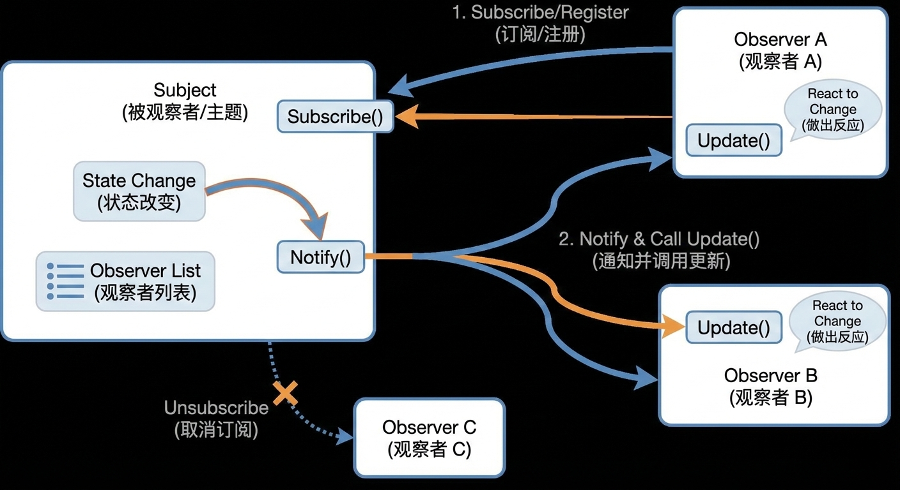

这张流程图完美地展示了**“观察者模式”的生命周期**。配合你刚才学的 C# `event`，我们来做一个“图文代码”三合一的深度解析。

---

### 一、 流程图全解 (The Flow)

把这张图想象成 **“YouTube 频道订阅系统”**。

#### **左边的盒子：Subject (主题 / 被观察者)**

- **身份：** 它是那个“搞事情”的人（比如你的 `GameInput`，或者一个 YouTuber）。
    
- **手里的资源：**
    
    1. **Observer List (名单)：** 一个小本本，记着谁订阅了我（在 C# 里，`event` 自动帮你维护这个名单）。
        
    2. **State Change (状态改变)：** 发生大新闻了（比如“按键被按下了”）。
        

#### **右边的盒子：Observer (观察者)**

- **身份：** 它是那个“吃瓜群众”（比如你的 `Player`，或者粉丝）。
    
- **动作：** 它等着大新闻发生，然后做出反应（比如“去切菜”）。
    

#### **流程三部曲（跟着箭头走）：**

1. **Subscribe / Register (订阅/注册)：**
    
    - **图示：** 蓝线从 Observer 指向 Subject。
        
    - **含义：** 粉丝对 YouTuber 说：“关注了！”
        
    - **代码：** `gameInput.OnInteractAction += ...`
        
2. **Notify (通知)：**
    
    - **图示：** 橙线从 Subject 发射出来，分发给所有 Observer。
        
    - **含义：** YouTuber 发布新视频，系统自动推送给所有粉丝。
        
    - **代码：** `OnInteractAction?.Invoke(...)`
        
3. **Update / React (更新/反应)：**
    
    - **图示：** Observer 内部的小气泡。
        
    - **含义：** 粉丝收到推送后，点开视频开始看（执行具体的逻辑）。
        
    - **代码：** `HandleInteractions()`
        

---

### 二、 核心单词本 (Vocabulary & IPA)

这是设计模式和编程中最高频的词汇，一定要读准（美式发音）。

|**单词**|**音标 (US)**|**含义**|**记忆语境**|
|---|---|---|---|
|**Observer**|`/əbˈzɜːrvər/`|**观察者**|看着别人的人（你的 `Player`）。|
|**Subject**|`/ˈsʌbdʒɪkt/`|**主题/被观察者**|被看着的人（你的 `GameInput`）。      _(注：作名词时重音在最前)_|
|**Subscribe**|`/səbˈskraɪb/`|**订阅**|代码里的 `+=`。|
|**Unsubscribe**|`/ˌʌnsəbˈskraɪb/`|**取消订阅**|代码里的 `-=`。|
|**Register**|`/ˈredʒɪstər/`|**注册**|和 Subscribe 一个意思，把名字登记上去。|
|**Notify**|`/ˈnoʊtɪfaɪ/`|**通知**|代码里的 `.Invoke()`。|
|**Update**|`/ʌpˈdeɪt/`|**更新**|也就是“收到通知后要执行的那个函数”。|
|**React**|`/riˈækt/`|**反应**|对变化做出应对。|

---

### 三、 破局者总结：图与代码的映射

最后，把你今天的代码直接贴在脑子里的这张图上：

1. **Subject (左边大框)** = 你的 **`GameInput.cs`**
    
    - _Observer List_ = `public event EventHandler OnInteractAction;`
        
    - _Notify()_ = `OnInteractAction?.Invoke(...);`
        
2. **Observer (右边大框)** = 你的 **`Player.cs`**
    
    - _Subscribe()_ = `gameInput.OnInteractAction += ...`
        
    - _Update()_ = `HandleInteractions()`
        

**这张图就是你代码的“X光片”。存好它，以后面试问你“什么是观察者模式”，你就把这个流程讲一遍！**