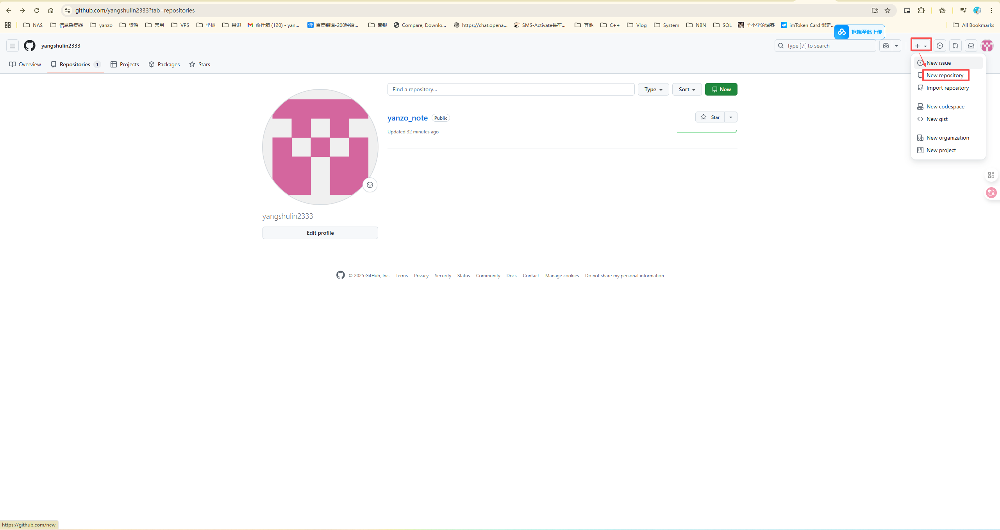
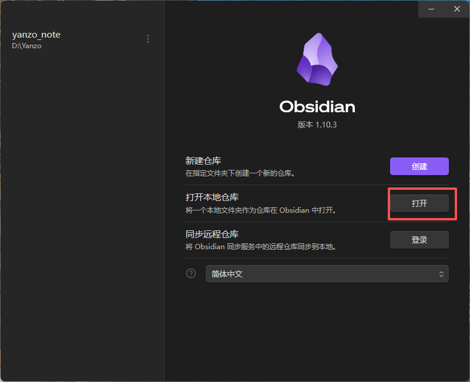
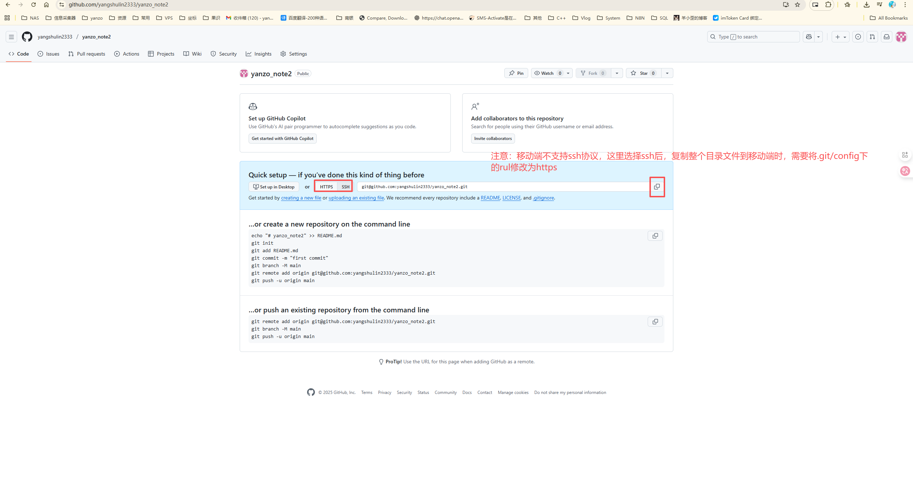
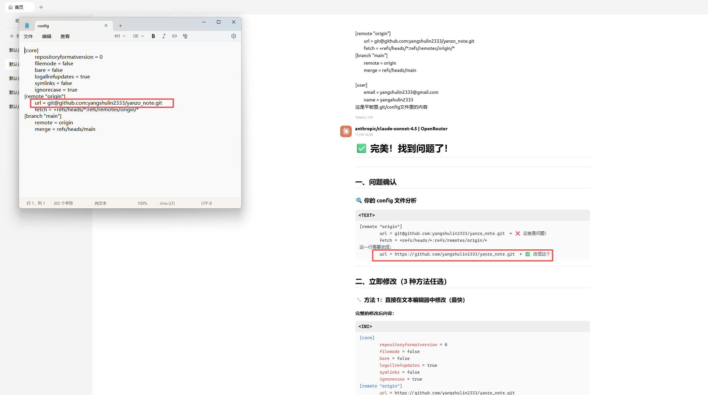
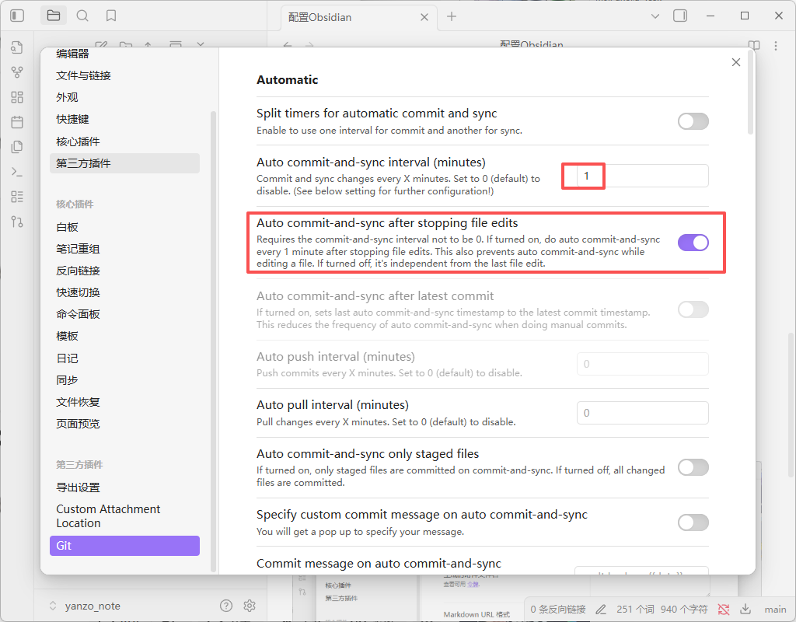
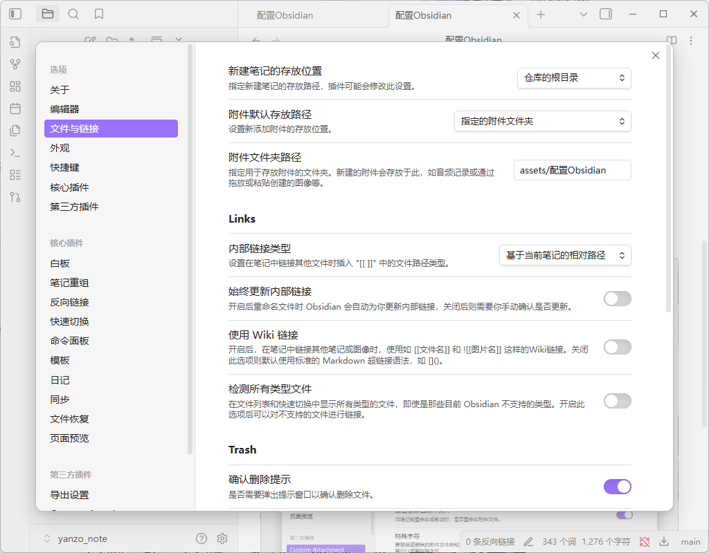

[# Obsidian邪修用法，免费云同步，AI，手机端，还有进阶技巧](https://www.youtube.com/watch?v=IlNOhNeWGgY&t=106s)

[操作文档](https://publish.obsidian.md/help-zh/%E7%94%B1%E6%AD%A4%E5%BC%80%E5%A7%8B)

## git云同步
1. 登录个人git账户，新建git仓库[📚 Git命令完全教程](📚%20Git命令完全教程.md)
	- 
	- 
2. `git init`  # 初始化仓库
	初始化仓库后代开该地址。
	
3. 打开根目录，添加`.ignore`文件,文件内容为：
	```b
	.obsidian/workspace.json
	.obsidian/workspace-mobile.json
	```
4. 添加到缓存区并commit提交文件到git
   ```bash
	git add . # 添加当前目录所有文件
   git commit -m "首次提交" #把暂存区的内容正式保存到Git仓库，并附上说明
   git remote -v          # 查看详细信息
   git clone git@github.com:yangshulin2333/yanzo_note2.git #ssh协议
   git clone https://github.com/yangshulin2333/yanzo_note2.git #https协议
   ```
	- 
	- 注意：移动端暂不支持ssh协议 
5. 借助git第三方插件设置Obsidian自动云同步到git
	- 开启`Pull on startup`选项
	- 开启`Auto commit-and-sync after stopping file edits`选项
	- 设置`Auto commit-and-sync interval (minutes)`自动提交时间
	- []()

## git同步图片上传
第三方插件`Custom Attachment Location`
- 修改Markdown URL格式：`assets/${noteFileName}/${generatedAttachmentFileName}`
- 附件重命名模式选择`全部`
- 开启`是否重命名附件文件`
- 选项设置
	- 关闭`使用Wiki链接`
	- `内部链接类型`选择`基于当前笔记的相对路径`



## 接入Gemini-CLI AI编程工具


接入Pandoc导出工具
[Github地址](https://github.com/jgm/pandoc/releases/tag/3.8.3)

C:\Program Files\Pandoc\pandoc.exe